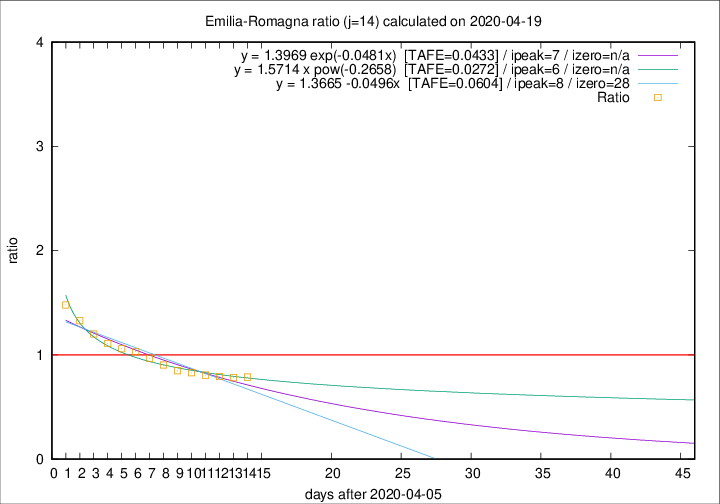

# Emilia-Romagna

Data source: https://raw.githubusercontent.com/pcm-dpc/COVID-19/master/dati-json/dpc-covid19-ita-regioni.json

Delta days analysis (j): 14

Analyses for other values of j for 2020-04-19 are avalable [here](../2020-04-19/README.md)

Analyses for Emilia-Romagna for previous dates are avalable [here](../README.md)

## Fitting 
|fit type|best fit equation|tafe|tfe|ipeak|izero|
|-------|-----|--------|------|---|---|
|linear|y = 1.3665 -0.0496x  [TAFE=0.0604]|0.0604|0.0022|8|28|
|exp|y = 1.3969 exp(-0.0481x)  [TAFE=0.0433]|0.0433|0.0011|7|n/a|
|pow|y = 1.5714 x pow(-0.2658)  [TAFE=0.0272]|0.0272|0.0004|6|n/a|

## Data
|Date|Daily deaths|Cumulated deaths|Deaths in the last 14 days|Deaths in the 14 days before|ratio|
|----|----------|-----------|-------|--------------------|-----|
|2020-04-19|58|3023|972|1235|0.7870|
|2020-04-18|62|2965|988|1262|0.7829|
|2020-04-17|60|2903|1001|1262|0.7932|
|2020-04-16|55|2843|1032|1280|0.8063|
|2020-04-15|83|2788|1056|1274|0.8289|
|2020-04-14|90|2705|1061|1251|0.8481|
|2020-04-13|51|2615|1077|1192|0.9035|
|2020-04-12|83|2564|1121|1159|0.9672|
|2020-04-11|84|2481|1137|1103|1.0308|
|2020-04-10|81|2397|1130|1066|1.0600|
|2020-04-09|82|2316|1142|1028|1.1109|
|2020-04-08|54|2234|1157|964|1.2002|
|2020-04-07|72|2180|1195|900|1.3278|
|2020-04-06|57|2108|1216|822|1.4793|

[Download data as CSV](COVID-19_emilia-romagna_j14_2020-04-19.csv)

Generated April 19th, 2020 at 18:42:39 UTC+0200 with https://github.com/robianc/COVID-19
