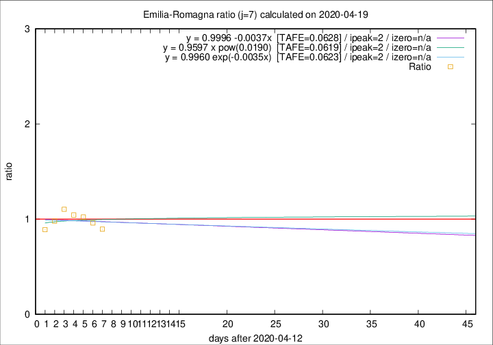

# Emilia-Romagna

Data source: https://raw.githubusercontent.com/pcm-dpc/COVID-19/master/dati-json/dpc-covid19-ita-regioni.json

Delta days analysis (j): 7

Analyses for other values of j for 2020-04-19 are avalable [here](../2020-04-19/README.md)

Analyses for Emilia-Romagna for previous dates are avalable [here](../README.md)

## Fitting 
|fit type|best fit equation|tafe|tfe|ipeak|izero|
|-------|-----|--------|------|---|---|
|linear|y = 0.9996 -0.0037x  [TAFE=0.0628]|0.0628|0.0054|2|n/a|
|exp|y = 0.9960 exp(-0.0035x)  [TAFE=0.0623]|0.0623|0.0027|2|n/a|
|pow|y = 0.9597 x pow(0.0190)  [TAFE=0.0619]|0.0619|0.0027|2|n/a|

## Data
|Date|Daily deaths|Cumulated deaths|Deaths in the last 7 days|Deaths in the 7 days before|ratio|
|----|----------|-----------|-------|--------------------|-----|
|2020-04-19|58|3023|459|513|0.8947|
|2020-04-18|62|2965|484|504|0.9603|
|2020-04-17|60|2903|506|495|1.0222|
|2020-04-16|55|2843|527|505|1.0436|
|2020-04-15|83|2788|554|502|1.1036|
|2020-04-14|90|2705|525|536|0.9795|
|2020-04-13|51|2615|507|570|0.8895|

[Download data as CSV](COVID-19_emilia-romagna_j7_2020-04-19.csv)

Generated April 19th, 2020 at 18:42:39 UTC+0200 with https://github.com/robianc/COVID-19
