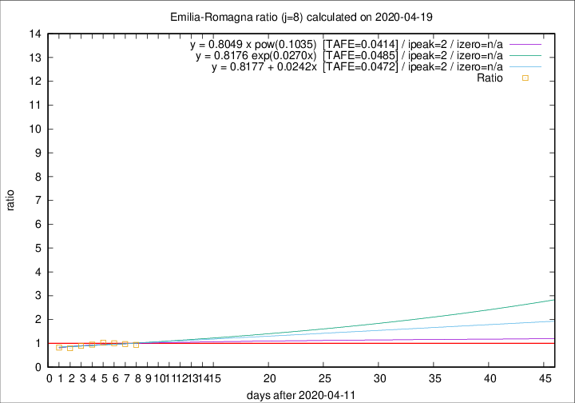

# Emilia-Romagna

Data source: https://raw.githubusercontent.com/pcm-dpc/COVID-19/master/dati-json/dpc-covid19-ita-regioni.json

Delta days analysis (j): 8

Analyses for other values of j for 2020-04-19 are avalable [here](../2020-04-19/README.md)

Analyses for Emilia-Romagna for previous dates are avalable [here](../README.md)

## Fitting 
|fit type|best fit equation|tafe|tfe|ipeak|izero|
|-------|-----|--------|------|---|---|
|linear|y = 0.8177 + 0.0242x  [TAFE=0.0472]|0.0472|0.0034|2|n/a|
|exp|y = 0.8176 exp(0.0270x)  [TAFE=0.0485]|0.0485|0.0016|2|n/a|
|pow|y = 0.8049 x pow(0.1035)  [TAFE=0.0414]|0.0414|0.0013|2|n/a|

## Data
|Date|Daily deaths|Cumulated deaths|Deaths in the last 8 days|Deaths in the 8 days before|ratio|
|----|----------|-----------|-------|--------------------|-----|
|2020-04-19|58|3023|542|579|0.9361|
|2020-04-18|62|2965|568|586|0.9693|
|2020-04-17|60|2903|587|584|1.0051|
|2020-04-16|55|2843|609|590|1.0322|
|2020-04-15|83|2788|608|642|0.9470|
|2020-04-14|90|2705|597|665|0.8977|
|2020-04-13|51|2615|564|707|0.7977|
|2020-04-12|83|2564|587|710|0.8268|

[Download data as CSV](COVID-19_emilia-romagna_j8_2020-04-19.csv)

Generated April 19th, 2020 at 18:42:39 UTC+0200 with https://github.com/robianc/COVID-19
