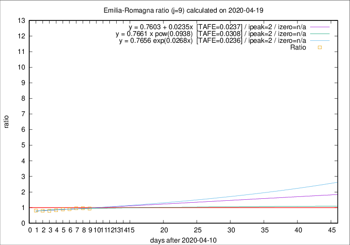
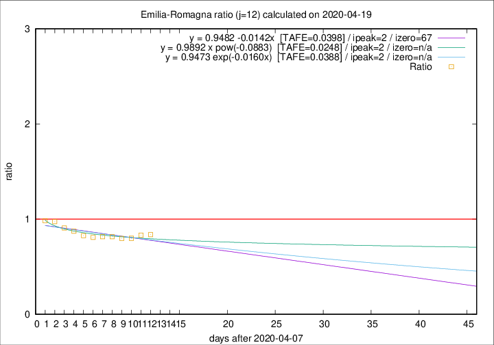

# Emilia-Romagna

Data source: https://raw.githubusercontent.com/pcm-dpc/COVID-19/master/dati-json/dpc-covid19-ita-regioni.json

Estimates in this page were made on 19/4/2020 with data available until 19/04/2020.

## Summary 

### Peak estimate 
|j|linear [TAFE]|exponential [TAFE]|power law [TAFE]|details|
|---|----|-----------|---------|-------|
|7|15/4/2020 [TAFE=0.0628]|15/4/2020 [TAFE=0.0623]|15/4/2020 [TAFE=0.0619]|[analysis](COVID-19_emilia-romagna_j7_2020-04-19.md)|
|8|14/4/2020 [TAFE=0.0472]|14/4/2020 [TAFE=0.0485]|14/4/2020 [TAFE=0.0414]|[analysis](COVID-19_emilia-romagna_j8_2020-04-19.md)|
|9|13/4/2020 [TAFE=0.0237]|13/4/2020 [TAFE=0.0236]|13/4/2020 [TAFE=0.0308]|[analysis](COVID-19_emilia-romagna_j9_2020-04-19.md)|
|10|12/4/2020 [TAFE=0.0241]|12/4/2020 [TAFE=0.0236]|12/4/2020 [TAFE=0.0306]|[analysis](COVID-19_emilia-romagna_j10_2020-04-19.md)|
|11|11/4/2020 [TAFE=0.0308]|11/4/2020 [TAFE=0.0308]|11/4/2020 [TAFE=0.0305]|[analysis](COVID-19_emilia-romagna_j11_2020-04-19.md)|
|12|10/4/2020 [TAFE=0.0398]|10/4/2020 [TAFE=0.0388]|10/4/2020 [TAFE=0.0248]|[analysis](COVID-19_emilia-romagna_j12_2020-04-19.md)|
|13|11/4/2020 [TAFE=0.0454]|11/4/2020 [TAFE=0.0388]|11/4/2020 [TAFE=0.0243]|[analysis](COVID-19_emilia-romagna_j13_2020-04-19.md)|
|14|14/4/2020 [TAFE=0.0604]|13/4/2020 [TAFE=0.0433]|12/4/2020 [TAFE=0.0272]|[analysis](COVID-19_emilia-romagna_j14_2020-04-19.md)|

Best estimator is exp with j=9 (TAFE=0.0236)
Corresponding peak date estimate is 13/4/2020 (ipeak 2)

Peak date range estimate: 13/4/2020 - 19/4/2020

### End estimate 
|j|linear [TAFE/TFE]|exponential [TAFE/TFE]|power law [TAFE/TFE]|details|
|---|----|-----------|---------|-------|
|7|-|-|-|[analysis](COVID-19_emilia-romagna_j7_2020-04-19.md)|
|8|-|-|-|[analysis](COVID-19_emilia-romagna_j8_2020-04-19.md)|
|9|-|-|-|[analysis](COVID-19_emilia-romagna_j9_2020-04-19.md)|
|10|-|-|-|[analysis](COVID-19_emilia-romagna_j10_2020-04-19.md)|
|11|-|-|-|[analysis](COVID-19_emilia-romagna_j11_2020-04-19.md)|
|12|14/6/2020 [TAFE=0.0398]|-|-|[analysis](COVID-19_emilia-romagna_j12_2020-04-19.md)|
|13|-|-|-|[analysis](COVID-19_emilia-romagna_j13_2020-04-19.md)|
|14|-|-|-|[analysis](COVID-19_emilia-romagna_j14_2020-04-19.md)|

Best estimator is linear with j=12 (TAFE=0.0398)
Corresponding end date estimate is 14/6/2020 (izero 67)

End date range estimate: 8/4/2020 - 14/6/2020

Generated April 19th, 2020 at 18:42:39 UTC+0200 with https://github.com/robianc/COVID-19
