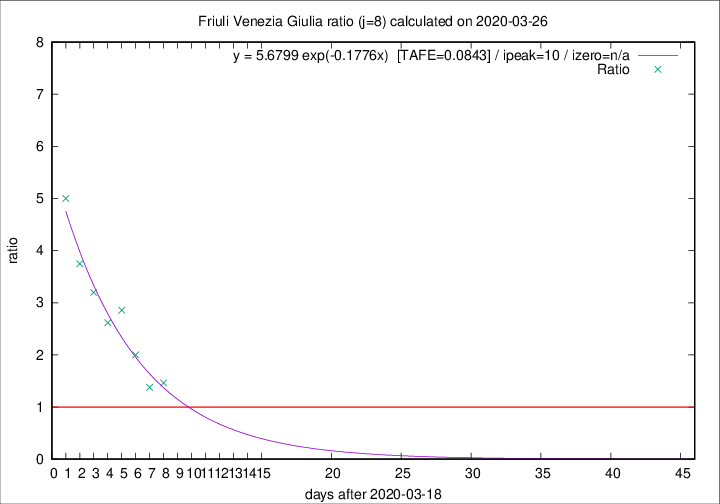

# Friuli Venezia Giulia

Data source: https://raw.githubusercontent.com/pcm-dpc/COVID-19/master/dati-json/dpc-covid19-ita-regioni.json

Estimates in this page were made on 9/4/2020 with data available until 26/03/2020.

## Summary 

### Peak estimate 
|j|linear [TAFE]|exponential [TAFE]|power law [TAFE]|details|
|---|----|-----------|---------|-------|
|7|28/3/2020 [TAFE=0.1521]|29/3/2020 [TAFE=0.1279]|3/4/2020 [TAFE=0.1100]|[analysis](COVID-19_friuli_venezia_giulia_j7_2020-03-26.md)|
|8|28/3/2020 [TAFE=0.1192]|29/3/2020 [TAFE=0.0843]|7/4/2020 [TAFE=0.1184]|[analysis](COVID-19_friuli_venezia_giulia_j8_2020-03-26.md)|
|9|26/3/2020 [TAFE=0.9808]|29/3/2020 [TAFE=0.2662]|2/4/2020 [TAFE=0.1390]|[analysis](COVID-19_friuli_venezia_giulia_j9_2020-03-26.md)|
|10|-|-|-||
|11|-|-|-||
|12|-|-|-||
|13|-|-|-||
|14|-|-|-||

Best estimator is exp with j=8 (TAFE=0.0843)
Corresponding peak date estimate is 29/3/2020 (ipeak 10)

Peak date range estimate: 19/3/2020 - 7/4/2020

### End estimate 
|j|linear [TAFE/TFE]|exponential [TAFE/TFE]|power law [TAFE/TFE]|details|
|---|----|-----------|---------|-------|
|7|1/4/2020 [TAFE=0.1521]|-|-|[analysis](COVID-19_friuli_venezia_giulia_j7_2020-03-26.md)|
|8|30/3/2020 [TAFE=0.1192]|-|-|[analysis](COVID-19_friuli_venezia_giulia_j8_2020-03-26.md)|
|9|-|-|-|[analysis](COVID-19_friuli_venezia_giulia_j9_2020-03-26.md)|
|10|-|-|-||
|11|-|-|-||
|12|-|-|-||
|13|-|-|-||
|14|-|-|-||

Best estimator is linear with j=8 (TAFE=0.1192)
Corresponding end date estimate is 30/3/2020 (izero 11)

End date range estimate: 19/3/2020 - 31/3/2020

Generated April 9th, 2020 at 16:40:48 UTC+0200 with https://github.com/robianc/COVID-19
