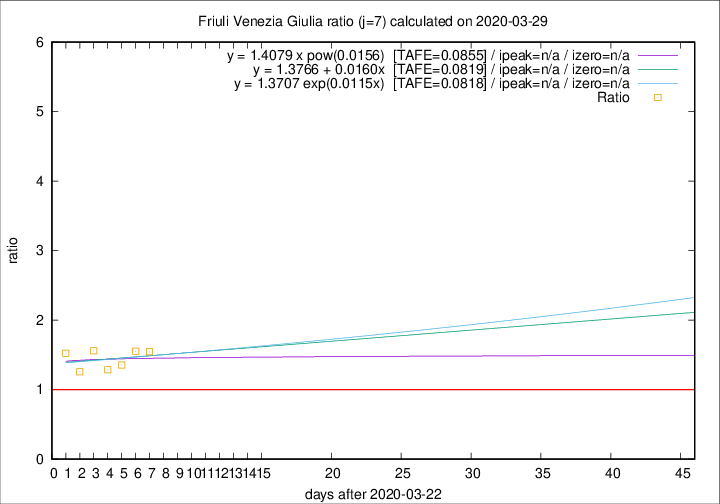

# Friuli Venezia Giulia

Data source: https://raw.githubusercontent.com/pcm-dpc/COVID-19/master/dati-json/dpc-covid19-ita-regioni.json

Delta days analysis (j): 7

Analyses for other values of j for 2020-03-29 are avalable [here](../README.md)

Analyses for Friuli Venezia Giulia for previous dates are avalable [here](../../README.md)

## Fitting 
|fit type|best fit equation|tafe|tfe|ipeak|izero|
|-------|-----|--------|------|---|---|
|linear|y = 1.3766 + 0.0160x  [TAFE=0.0819]|0.0819|0.0074|n/a|n/a|
|exp|y = 1.3707 exp(0.0115x)  [TAFE=0.0818]|0.0818|0.0039|n/a|n/a|
|pow|y = 1.4079 x pow(0.0156)  [TAFE=0.0855]|0.0855|0.0039|n/a|n/a|

## Data
|Date|Daily deaths|Cumulated deaths|Deaths in the last 7 days|Deaths in the 7 days before|ratio|
|----|----------|-----------|-------|--------------------|-----|
|2020-03-29|11|98|51|33|1.5455|
|2020-03-28|11|87|45|29|1.5517|
|2020-03-27|4|76|38|28|1.3571|
|2020-03-26|2|72|36|28|1.2857|
|2020-03-25|6|70|39|25|1.5600|
|2020-03-24|10|64|34|27|1.2593|
|2020-03-23|7|54|32|21|1.5238|

[Download data as CSV](COVID-19_friuli_venezia_giulia_j7_2020-03-29.csv)

Generated April 12th, 2020 at 16:28:18 UTC+0200 with https://github.com/robianc/COVID-19
