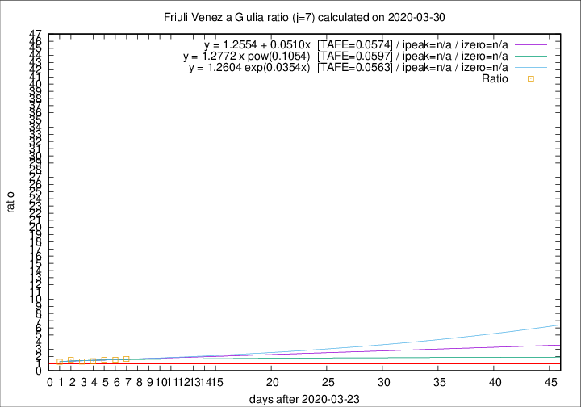

# Friuli Venezia Giulia

Data source: https://raw.githubusercontent.com/pcm-dpc/COVID-19/master/dati-json/dpc-covid19-ita-regioni.json

Delta days analysis (j): 7

Analyses for other values of j for 2020-03-30 are avalable [here](../README.md)

Analyses for Friuli Venezia Giulia for previous dates are avalable [here](../../README.md)

## Fitting 
|fit type|best fit equation|tafe|tfe|ipeak|izero|
|-------|-----|--------|------|---|---|
|linear|y = 1.2554 + 0.0510x  [TAFE=0.0574]|0.0574|0.0051|n/a|n/a|
|exp|y = 1.2604 exp(0.0354x)  [TAFE=0.0563]|0.0563|0.0025|n/a|n/a|
|pow|y = 1.2772 x pow(0.1054)  [TAFE=0.0597]|0.0597|0.0028|n/a|n/a|

## Data
|Date|Daily deaths|Cumulated deaths|Deaths in the last 7 days|Deaths in the 7 days before|ratio|
|----|----------|-----------|-------|--------------------|-----|
|2020-03-30|9|107|53|32|1.6562|
|2020-03-29|11|98|51|33|1.5455|
|2020-03-28|11|87|45|29|1.5517|
|2020-03-27|4|76|38|28|1.3571|
|2020-03-26|2|72|36|28|1.2857|
|2020-03-25|6|70|39|25|1.5600|
|2020-03-24|10|64|34|27|1.2593|

[Download data as CSV](COVID-19_friuli_venezia_giulia_j7_2020-03-30.csv)

Generated April 12th, 2020 at 16:28:18 UTC+0200 with https://github.com/robianc/COVID-19
