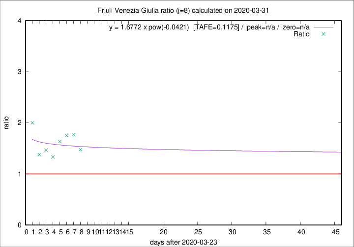

# Friuli Venezia Giulia

Data source: https://raw.githubusercontent.com/pcm-dpc/COVID-19/master/dati-json/dpc-covid19-ita-regioni.json

Estimates in this page were made on 19/4/2020 with data available until 31/03/2020.

## Summary 

### Peak estimate 
|j|linear [TAFE]|exponential [TAFE]|power law [TAFE]|details|
|---|----|-----------|---------|-------|
|7|-|-|-|[analysis](COVID-19_friuli_venezia_giulia_j7_2020-03-31.md)|
|8|23/6/2020 [TAFE=0.1186]|-|-|[analysis](COVID-19_friuli_venezia_giulia_j8_2020-03-31.md)|
|9|4/4/2020 [TAFE=0.2451]|7/4/2020 [TAFE=0.2157]|26/4/2020 [TAFE=0.1702]|[analysis](COVID-19_friuli_venezia_giulia_j9_2020-03-31.md)|
|10|2/4/2020 [TAFE=0.2321]|5/4/2020 [TAFE=0.1906]|20/4/2020 [TAFE=0.1722]|[analysis](COVID-19_friuli_venezia_giulia_j10_2020-03-31.md)|
|11|1/4/2020 [TAFE=0.3265]|4/4/2020 [TAFE=0.1521]|15/4/2020 [TAFE=0.1270]|[analysis](COVID-19_friuli_venezia_giulia_j11_2020-03-31.md)|
|12|30/3/2020 [TAFE=1.0610]|3/4/2020 [TAFE=0.2535]|12/4/2020 [TAFE=0.1545]|[analysis](COVID-19_friuli_venezia_giulia_j12_2020-03-31.md)|
|13|-|-|-||
|14|-|-|-||

Best estimator is linear with j=8 (TAFE=0.1186)
Corresponding peak date estimate is 23/6/2020 (ipeak 91)

Peak date range estimate: 24/3/2020 - 23/6/2020

### End estimate 
|j|linear [TAFE/TFE]|exponential [TAFE/TFE]|power law [TAFE/TFE]|details|
|---|----|-----------|---------|-------|
|7|-|-|-|[analysis](COVID-19_friuli_venezia_giulia_j7_2020-03-31.md)|
|8|-|-|-|[analysis](COVID-19_friuli_venezia_giulia_j8_2020-03-31.md)|
|9|9/4/2020 [TAFE=0.2451]|-|-|[analysis](COVID-19_friuli_venezia_giulia_j9_2020-03-31.md)|
|10|5/4/2020 [TAFE=0.2321]|-|-|[analysis](COVID-19_friuli_venezia_giulia_j10_2020-03-31.md)|
|11|-|-|-|[analysis](COVID-19_friuli_venezia_giulia_j11_2020-03-31.md)|
|12|-|-|-|[analysis](COVID-19_friuli_venezia_giulia_j12_2020-03-31.md)|
|13|-|-|-||
|14|-|-|-||

Best estimator is linear with j=10 (TAFE=0.2321)
Corresponding end date estimate is 5/4/2020 (izero 14)

End date range estimate: 22/3/2020 - 8/4/2020

Generated April 19th, 2020 at 18:42:39 UTC+0200 with https://github.com/robianc/COVID-19
