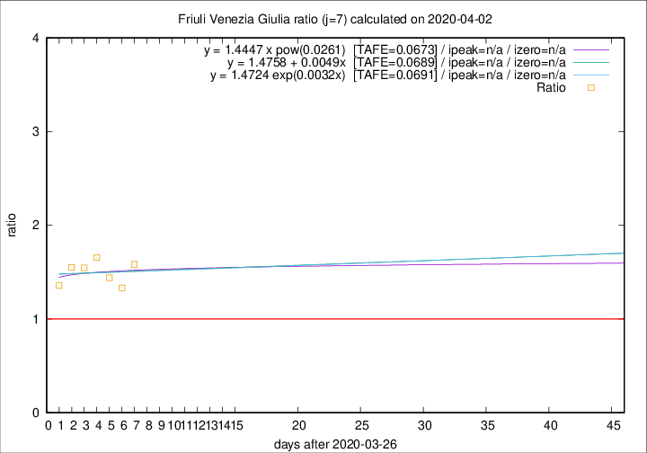

# Friuli Venezia Giulia

Data source: https://raw.githubusercontent.com/pcm-dpc/COVID-19/master/dati-json/dpc-covid19-ita-regioni.json

Delta days analysis (j): 7

Analyses for other values of j for 2020-04-02 are avalable [here](../2020-04-02/README.md)

Analyses for Friuli Venezia Giulia for previous dates are avalable [here](../README.md)

## Fitting 
|fit type|best fit equation|tafe|tfe|ipeak|izero|
|-------|-----|--------|------|---|---|
|linear|y = 1.4758 + 0.0049x  [TAFE=0.0689]|0.0689|0.0056|n/a|n/a|
|exp|y = 1.4724 exp(0.0032x)  [TAFE=0.0691]|0.0691|0.0029|n/a|n/a|
|pow|y = 1.4447 x pow(0.0261)  [TAFE=0.0673]|0.0673|0.0028|n/a|n/a|

## Data
|Date|Daily deaths|Cumulated deaths|Deaths in the last 7 days|Deaths in the 7 days before|ratio|
|----|----------|-----------|-------|--------------------|-----|
|2020-04-02|7|129|57|36|1.5833|
|2020-04-01|9|122|52|39|1.3333|
|2020-03-31|6|113|49|34|1.4412|
|2020-03-30|9|107|53|32|1.6562|
|2020-03-29|11|98|51|33|1.5455|
|2020-03-28|11|87|45|29|1.5517|
|2020-03-27|4|76|38|28|1.3571|

[Download data as CSV](COVID-19_friuli_venezia_giulia_j7_2020-04-02.csv)

Generated April 12th, 2020 at 17:02:01 UTC+0200 with https://github.com/robianc/COVID-19
