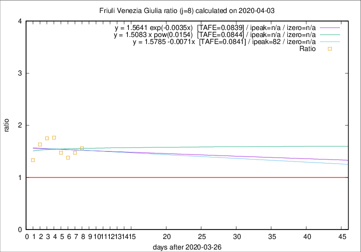

# Friuli Venezia Giulia

Data source: https://raw.githubusercontent.com/pcm-dpc/COVID-19/master/dati-json/dpc-covid19-ita-regioni.json

Delta days analysis (j): 8

Analyses for other values of j for 2020-04-03 are avalable [here](../2020-04-03/README.md)

Analyses for Friuli Venezia Giulia for previous dates are avalable [here](../README.md)

## Fitting 
|fit type|best fit equation|tafe|tfe|ipeak|izero|
|-------|-----|--------|------|---|---|
|linear|y = 1.5785 -0.0071x  [TAFE=0.0841]|0.0841|0.0093|82|n/a|
|exp|y = 1.5641 exp(-0.0035x)  [TAFE=0.0839]|0.0839|0.0048|n/a|n/a|
|pow|y = 1.5083 x pow(0.0154)  [TAFE=0.0844]|0.0844|0.0046|n/a|n/a|

## Data
|Date|Daily deaths|Cumulated deaths|Deaths in the last 8 days|Deaths in the 8 days before|ratio|
|----|----------|-----------|-------|--------------------|-----|
|2020-04-03|7|136|64|41|1.5610|
|2020-04-02|7|129|59|40|1.4750|
|2020-04-01|9|122|58|42|1.3810|
|2020-03-31|6|113|59|40|1.4750|
|2020-03-30|9|107|60|34|1.7647|
|2020-03-29|11|98|56|32|1.7500|
|2020-03-28|11|87|49|30|1.6333|
|2020-03-27|4|76|40|30|1.3333|

[Download data as CSV](COVID-19_friuli_venezia_giulia_j8_2020-04-03.csv)

Generated April 14th, 2020 at 19:16:04 UTC+0200 with https://github.com/robianc/COVID-19
