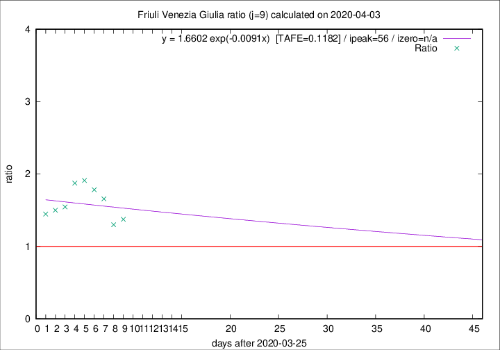

# Friuli Venezia Giulia

Data source: https://raw.githubusercontent.com/pcm-dpc/COVID-19/master/dati-json/dpc-covid19-ita-regioni.json

Delta days analysis (j): 9

Analyses for other values of j for 2020-04-03 are avalable [here](../README.md)

Analyses for Friuli Venezia Giulia for previous dates are avalable [here](../../README.md)

## Fitting 
|fit type|best fit equation|tafe|tfe|ipeak|izero|
|-------|-----|--------|------|---|---|
|exp|y = 1.6602 exp(-0.0091x)  [TAFE=0.1182]|0.1182|0.0080|56|n/a|

## Data
|Date|Daily deaths|Cumulated deaths|Deaths in the last 9 days|Deaths in the 9 days before|ratio|
|----|----------|-----------|-------|--------------------|-----|
|2020-04-03|7|136|66|48|1.3750|
|2020-04-02|7|129|65|50|1.3000|
|2020-04-01|9|122|68|41|1.6585|
|2020-03-31|6|113|66|37|1.7838|
|2020-03-30|9|107|65|34|1.9118|
|2020-03-29|11|98|60|32|1.8750|
|2020-03-28|11|87|51|33|1.5455|
|2020-03-27|4|76|45|30|1.5000|
|2020-03-26|2|72|42|29|1.4483|

[Download data as CSV](COVID-19_friuli_venezia_giulia_j9_2020-04-03.csv)

Generated April 12th, 2020 at 16:28:18 UTC+0200 with https://github.com/robianc/COVID-19
