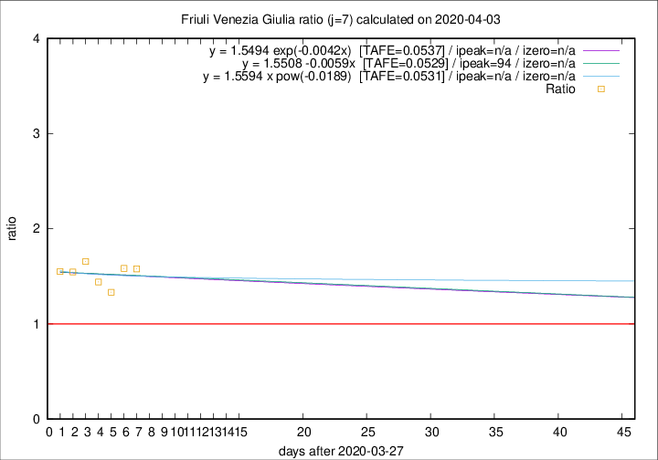

# Friuli Venezia Giulia

Data source: https://raw.githubusercontent.com/pcm-dpc/COVID-19/master/dati-json/dpc-covid19-ita-regioni.json

Estimates in this page were made on 10/4/2020 with data available until 03/04/2020.

## Summary 

### Peak estimate 
|j|linear [TAFE]|exponential [TAFE]|power law [TAFE]|details|
|---|----|-----------|---------|-------|
|7|30/6/2020 [TAFE=0.0529]|-|-|[analysis](COVID-19_friuli_venezia_giulia_j7_2020-04-03.md)|
|8|17/6/2020 [TAFE=0.0841]|-|-|[analysis](COVID-19_friuli_venezia_giulia_j8_2020-04-03.md)|
|9|18/5/2020 [TAFE=0.1195]|21/5/2020 [TAFE=0.1182]|-|[analysis](COVID-19_friuli_venezia_giulia_j9_2020-04-03.md)|
|10|7/4/2020 [TAFE=0.1794]|11/4/2020 [TAFE=0.1577]|6/5/2020 [TAFE=0.1457]|[analysis](COVID-19_friuli_venezia_giulia_j10_2020-04-03.md)|
|11|5/4/2020 [TAFE=0.2380]|9/4/2020 [TAFE=0.1801]|26/4/2020 [TAFE=0.1071]|[analysis](COVID-19_friuli_venezia_giulia_j11_2020-04-03.md)|
|12|4/4/2020 [TAFE=0.2422]|8/4/2020 [TAFE=0.1427]|27/4/2020 [TAFE=0.1127]|[analysis](COVID-19_friuli_venezia_giulia_j12_2020-04-03.md)|
|13|2/4/2020 [TAFE=0.9775]|6/4/2020 [TAFE=0.2516]|15/4/2020 [TAFE=0.0853]|[analysis](COVID-19_friuli_venezia_giulia_j13_2020-04-03.md)|
|14|-|-|-||

Best estimator is linear with j=7 (TAFE=0.0529)
Corresponding peak date estimate is 30/6/2020 (ipeak 94)

Peak date range estimate: 28/3/2020 - 30/6/2020

### End estimate 
|j|linear [TAFE/TFE]|exponential [TAFE/TFE]|power law [TAFE/TFE]|details|
|---|----|-----------|---------|-------|
|7|-|-|-|[analysis](COVID-19_friuli_venezia_giulia_j7_2020-04-03.md)|
|8|-|-|-|[analysis](COVID-19_friuli_venezia_giulia_j8_2020-04-03.md)|
|9|-|-|-|[analysis](COVID-19_friuli_venezia_giulia_j9_2020-04-03.md)|
|10|14/4/2020 [TAFE=0.1794]|-|-|[analysis](COVID-19_friuli_venezia_giulia_j10_2020-04-03.md)|
|11|-|-|-|[analysis](COVID-19_friuli_venezia_giulia_j11_2020-04-03.md)|
|12|-|-|-|[analysis](COVID-19_friuli_venezia_giulia_j12_2020-04-03.md)|
|13|-|-|-|[analysis](COVID-19_friuli_venezia_giulia_j13_2020-04-03.md)|
|14|-|-|-||

Best estimator is linear with j=10 (TAFE=0.1794)
Corresponding end date estimate is 14/4/2020 (izero 20)

End date range estimate: 25/3/2020 - 14/4/2020

Generated April 10th, 2020 at 17:26:10 UTC+0200 with https://github.com/robianc/COVID-19
