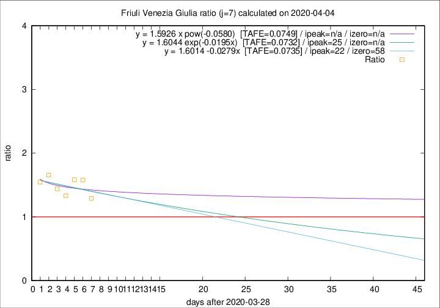

# Friuli Venezia Giulia

Data source: https://raw.githubusercontent.com/pcm-dpc/COVID-19/master/dati-json/dpc-covid19-ita-regioni.json

Delta days analysis (j): 7

Analyses for other values of j for 2020-04-04 are avalable [here](../README.md)

Analyses for Friuli Venezia Giulia for previous dates are avalable [here](../../README.md)

## Fitting 
|fit type|best fit equation|tafe|tfe|ipeak|izero|
|-------|-----|--------|------|---|---|
|linear|y = 1.6014 -0.0279x  [TAFE=0.0735]|0.0735|0.0063|22|58|
|exp|y = 1.6044 exp(-0.0195x)  [TAFE=0.0732]|0.0732|0.0031|25|n/a|
|pow|y = 1.5926 x pow(-0.0580)  [TAFE=0.0749]|0.0749|0.0032|n/a|n/a|

## Data
|Date|Daily deaths|Cumulated deaths|Deaths in the last 7 days|Deaths in the 7 days before|ratio|
|----|----------|-----------|-------|--------------------|-----|
|2020-04-04|9|145|58|45|1.2889|
|2020-04-03|7|136|60|38|1.5789|
|2020-04-02|7|129|57|36|1.5833|
|2020-04-01|9|122|52|39|1.3333|
|2020-03-31|6|113|49|34|1.4412|
|2020-03-30|9|107|53|32|1.6562|
|2020-03-29|11|98|51|33|1.5455|

[Download data as CSV](COVID-19_friuli_venezia_giulia_j7_2020-04-04.csv)

Generated April 12th, 2020 at 16:28:18 UTC+0200 with https://github.com/robianc/COVID-19
