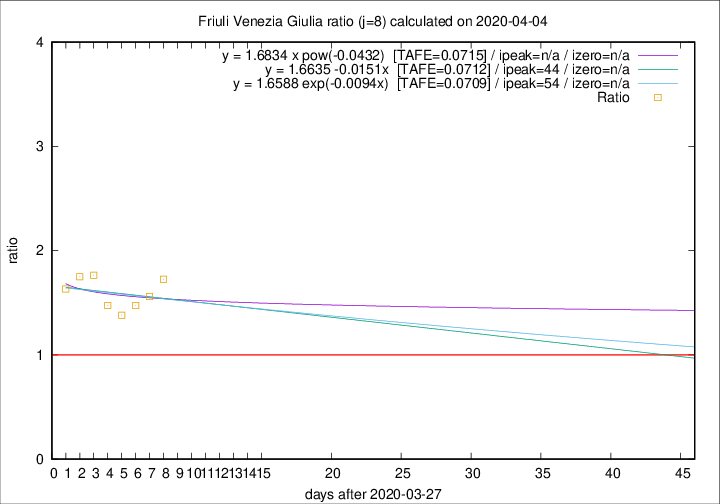

# Friuli Venezia Giulia

Data source: https://raw.githubusercontent.com/pcm-dpc/COVID-19/master/dati-json/dpc-covid19-ita-regioni.json

Estimates in this page were made on 19/4/2020 with data available until 04/04/2020.

## Summary 

### Peak estimate 
|j|linear [TAFE]|exponential [TAFE]|power law [TAFE]|details|
|---|----|-----------|---------|-------|
|7|20/4/2020 [TAFE=0.0735]|23/4/2020 [TAFE=0.0732]|-|[analysis](COVID-19_friuli_venezia_giulia_j7_2020-04-04.md)|
|8|11/5/2020 [TAFE=0.0712]|21/5/2020 [TAFE=0.0709]|-|[analysis](COVID-19_friuli_venezia_giulia_j8_2020-04-04.md)|
|9|11/5/2020 [TAFE=0.1177]|17/5/2020 [TAFE=0.1181]|-|[analysis](COVID-19_friuli_venezia_giulia_j9_2020-04-04.md)|
|10|14/4/2020 [TAFE=0.1084]|18/4/2020 [TAFE=0.1091]|-|[analysis](COVID-19_friuli_venezia_giulia_j10_2020-04-04.md)|
|11|7/4/2020 [TAFE=0.1946]|10/4/2020 [TAFE=0.1473]|30/4/2020 [TAFE=0.0995]|[analysis](COVID-19_friuli_venezia_giulia_j11_2020-04-04.md)|
|12|5/4/2020 [TAFE=0.2281]|9/4/2020 [TAFE=0.1453]|28/4/2020 [TAFE=0.0889]|[analysis](COVID-19_friuli_venezia_giulia_j12_2020-04-04.md)|
|13|4/4/2020 [TAFE=0.3980]|8/4/2020 [TAFE=0.1627]|23/4/2020 [TAFE=0.0779]|[analysis](COVID-19_friuli_venezia_giulia_j13_2020-04-04.md)|
|14|-|-|-||

Best estimator is exp with j=8 (TAFE=0.0709)
Corresponding peak date estimate is 21/5/2020 (ipeak 54)

Peak date range estimate: 28/3/2020 - 21/5/2020

### End estimate 
|j|linear [TAFE/TFE]|exponential [TAFE/TFE]|power law [TAFE/TFE]|details|
|---|----|-----------|---------|-------|
|7|26/5/2020 [TAFE=0.0735]|-|-|[analysis](COVID-19_friuli_venezia_giulia_j7_2020-04-04.md)|
|8|-|-|-|[analysis](COVID-19_friuli_venezia_giulia_j8_2020-04-04.md)|
|9|-|-|-|[analysis](COVID-19_friuli_venezia_giulia_j9_2020-04-04.md)|
|10|-|-|-|[analysis](COVID-19_friuli_venezia_giulia_j10_2020-04-04.md)|
|11|-|-|-|[analysis](COVID-19_friuli_venezia_giulia_j11_2020-04-04.md)|
|12|-|-|-|[analysis](COVID-19_friuli_venezia_giulia_j12_2020-04-04.md)|
|13|-|-|-|[analysis](COVID-19_friuli_venezia_giulia_j13_2020-04-04.md)|
|14|-|-|-||

Best estimator is linear with j=7 (TAFE=0.0735)
Corresponding end date estimate is 26/5/2020 (izero 58)

End date range estimate: 29/3/2020 - 26/5/2020

Generated April 19th, 2020 at 18:42:39 UTC+0200 with https://github.com/robianc/COVID-19
