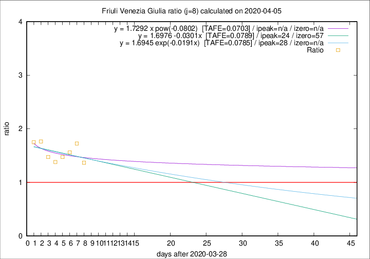

# Friuli Venezia Giulia

Data source: https://raw.githubusercontent.com/pcm-dpc/COVID-19/master/dati-json/dpc-covid19-ita-regioni.json

Delta days analysis (j): 8

Analyses for other values of j for 2020-04-05 are avalable [here](../README.md)

Analyses for Friuli Venezia Giulia for previous dates are avalable [here](../../README.md)

## Fitting 
|fit type|best fit equation|tafe|tfe|ipeak|izero|
|-------|-----|--------|------|---|---|
|linear|y = 1.6976 -0.0301x  [TAFE=0.0789]|0.0789|0.0076|24|57|
|exp|y = 1.6945 exp(-0.0191x)  [TAFE=0.0785]|0.0785|0.0039|28|n/a|
|pow|y = 1.7292 x pow(-0.0802)  [TAFE=0.0703]|0.0703|0.0033|n/a|n/a|

## Data
|Date|Daily deaths|Cumulated deaths|Deaths in the last 8 days|Deaths in the 8 days before|ratio|
|----|----------|-----------|-------|--------------------|-----|
|2020-04-05|9|154|67|49|1.3673|
|2020-04-04|9|145|69|40|1.7250|
|2020-04-03|7|136|64|41|1.5610|
|2020-04-02|7|129|59|40|1.4750|
|2020-04-01|9|122|58|42|1.3810|
|2020-03-31|6|113|59|40|1.4750|
|2020-03-30|9|107|60|34|1.7647|
|2020-03-29|11|98|56|32|1.7500|

[Download data as CSV](COVID-19_friuli_venezia_giulia_j8_2020-04-05.csv)

Generated April 12th, 2020 at 16:28:18 UTC+0200 with https://github.com/robianc/COVID-19
