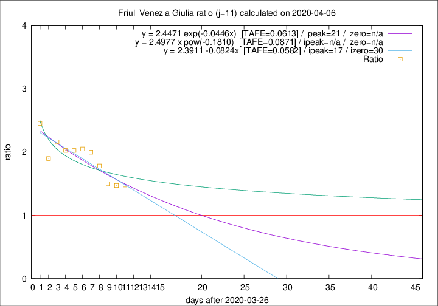

# Friuli Venezia Giulia

Data source: https://raw.githubusercontent.com/pcm-dpc/COVID-19/master/dati-json/dpc-covid19-ita-regioni.json

Delta days analysis (j): 11

Analyses for other values of j for 2020-04-06 are avalable [here](../2020-04-06/README.md)

Analyses for Friuli Venezia Giulia for previous dates are avalable [here](../README.md)

## Fitting 
|fit type|best fit equation|tafe|tfe|ipeak|izero|
|-------|-----|--------|------|---|---|
|linear|y = 2.3911 -0.0824x  [TAFE=0.0582]|0.0582|0.0059|17|30|
|exp|y = 2.4471 exp(-0.0446x)  [TAFE=0.0613]|0.0613|0.0029|21|n/a|
|pow|y = 2.4977 x pow(-0.1810)  [TAFE=0.0871]|0.0871|0.0046|n/a|n/a|

## Data
|Date|Daily deaths|Cumulated deaths|Deaths in the last 11 days|Deaths in the 11 days before|ratio|
|----|----------|-----------|-------|--------------------|-----|
|2020-04-06|4|158|86|58|1.4828|
|2020-04-05|9|154|84|57|1.4737|
|2020-04-04|9|145|81|54|1.5000|
|2020-04-03|7|136|82|46|1.7826|
|2020-04-02|7|129|82|41|2.0000|
|2020-04-01|9|122|80|39|2.0513|
|2020-03-31|6|113|75|37|2.0270|
|2020-03-30|9|107|71|35|2.0286|
|2020-03-29|11|98|67|31|2.1613|
|2020-03-28|11|87|57|30|1.9000|
|2020-03-27|4|76|54|22|2.4545|

[Download data as CSV](COVID-19_friuli_venezia_giulia_j11_2020-04-06.csv)

Generated April 12th, 2020 at 17:02:01 UTC+0200 with https://github.com/robianc/COVID-19
