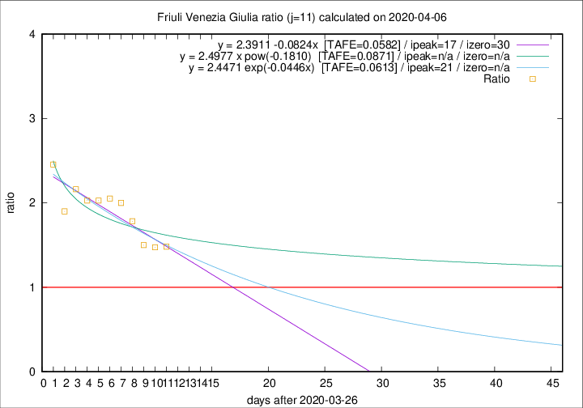

# Friuli Venezia Giulia

Data source: https://raw.githubusercontent.com/pcm-dpc/COVID-19/master/dati-json/dpc-covid19-ita-regioni.json

Estimates in this page were made on 10/4/2020 with data available until 06/04/2020.

## Summary 

### Peak estimate 
|j|linear [TAFE]|exponential [TAFE]|power law [TAFE]|details|
|---|----|-----------|---------|-------|
|7|9/4/2020 [TAFE=0.1000]|9/4/2020 [TAFE=0.1033]|19/4/2020 [TAFE=0.1234]|[analysis](COVID-19_friuli_venezia_giulia_j7_2020-04-06.md)|
|8|13/4/2020 [TAFE=0.0971]|14/4/2020 [TAFE=0.0971]|24/6/2020 [TAFE=0.0936]|[analysis](COVID-19_friuli_venezia_giulia_j8_2020-04-06.md)|
|9|17/4/2020 [TAFE=0.0939]|20/4/2020 [TAFE=0.0934]|-|[analysis](COVID-19_friuli_venezia_giulia_j9_2020-04-06.md)|
|10|21/4/2020 [TAFE=0.0904]|25/4/2020 [TAFE=0.0903]|-|[analysis](COVID-19_friuli_venezia_giulia_j10_2020-04-06.md)|
|11|13/4/2020 [TAFE=0.0582]|17/4/2020 [TAFE=0.0613]|-|[analysis](COVID-19_friuli_venezia_giulia_j11_2020-04-06.md)|
|12|8/4/2020 [TAFE=0.1493]|12/4/2020 [TAFE=0.1017]|3/5/2020 [TAFE=0.0839]|[analysis](COVID-19_friuli_venezia_giulia_j12_2020-04-06.md)|
|13|7/4/2020 [TAFE=0.2294]|11/4/2020 [TAFE=0.1265]|30/4/2020 [TAFE=0.0815]|[analysis](COVID-19_friuli_venezia_giulia_j13_2020-04-06.md)|
|14|6/4/2020 [TAFE=0.4608]|10/4/2020 [TAFE=0.1736]|26/4/2020 [TAFE=0.0750]|[analysis](COVID-19_friuli_venezia_giulia_j14_2020-04-06.md)|

Best estimator is linear with j=11 (TAFE=0.0582)
Corresponding peak date estimate is 13/4/2020 (ipeak 17)

Peak date range estimate: 27/3/2020 - 21/6/2020

### End estimate 
|j|linear [TAFE/TFE]|exponential [TAFE/TFE]|power law [TAFE/TFE]|details|
|---|----|-----------|---------|-------|
|7|21/4/2020 [TAFE=0.1000]|-|-|[analysis](COVID-19_friuli_venezia_giulia_j7_2020-04-06.md)|
|8|3/5/2020 [TAFE=0.0971]|-|-|[analysis](COVID-19_friuli_venezia_giulia_j8_2020-04-06.md)|
|9|8/5/2020 [TAFE=0.0939]|-|-|[analysis](COVID-19_friuli_venezia_giulia_j9_2020-04-06.md)|
|10|16/5/2020 [TAFE=0.0904]|-|-|[analysis](COVID-19_friuli_venezia_giulia_j10_2020-04-06.md)|
|11|26/4/2020 [TAFE=0.0582]|-|-|[analysis](COVID-19_friuli_venezia_giulia_j11_2020-04-06.md)|
|12|-|-|-|[analysis](COVID-19_friuli_venezia_giulia_j12_2020-04-06.md)|
|13|-|-|-|[analysis](COVID-19_friuli_venezia_giulia_j13_2020-04-06.md)|
|14|-|-|-|[analysis](COVID-19_friuli_venezia_giulia_j14_2020-04-06.md)|

Best estimator is linear with j=11 (TAFE=0.0582)
Corresponding end date estimate is 26/4/2020 (izero 30)

End date range estimate: 27/3/2020 - 15/5/2020

Generated April 10th, 2020 at 17:26:10 UTC+0200 with https://github.com/robianc/COVID-19
