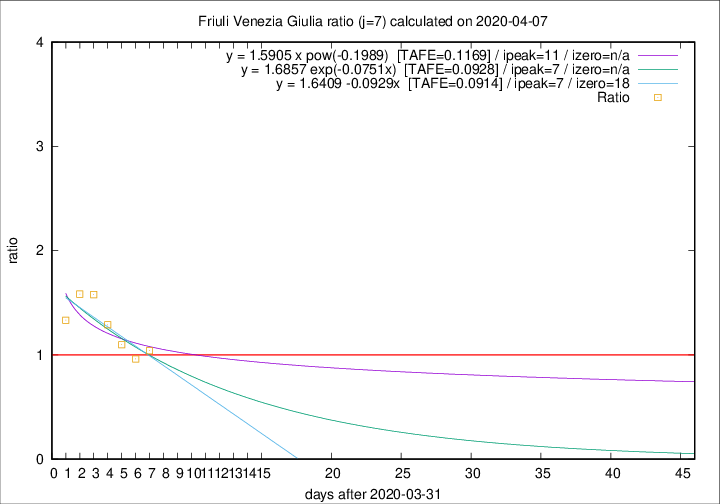

# Friuli Venezia Giulia

Data source: https://raw.githubusercontent.com/pcm-dpc/COVID-19/master/dati-json/dpc-covid19-ita-regioni.json

Delta days analysis (j): 7

Analyses for other values of j for 2020-04-07 are avalable [here](../2020-04-07/README.md)

Analyses for Friuli Venezia Giulia for previous dates are avalable [here](../README.md)

## Fitting 
|fit type|best fit equation|tafe|tfe|ipeak|izero|
|-------|-----|--------|------|---|---|
|linear|y = 1.6409 -0.0929x  [TAFE=0.0914]|0.0914|0.0109|7|18|
|exp|y = 1.6857 exp(-0.0751x)  [TAFE=0.0928]|0.0928|0.0054|7|n/a|
|pow|y = 1.5905 x pow(-0.1989)  [TAFE=0.1169]|0.1169|0.0087|11|n/a|

## Data
|Date|Daily deaths|Cumulated deaths|Deaths in the last 7 days|Deaths in the 7 days before|ratio|
|----|----------|-----------|-------|--------------------|-----|
|2020-04-07|6|164|51|49|1.0408|
|2020-04-06|4|158|51|53|0.9623|
|2020-04-05|9|154|56|51|1.0980|
|2020-04-04|9|145|58|45|1.2889|
|2020-04-03|7|136|60|38|1.5789|
|2020-04-02|7|129|57|36|1.5833|
|2020-04-01|9|122|52|39|1.3333|

[Download data as CSV](COVID-19_friuli_venezia_giulia_j7_2020-04-07.csv)

Generated April 14th, 2020 at 19:16:04 UTC+0200 with https://github.com/robianc/COVID-19
