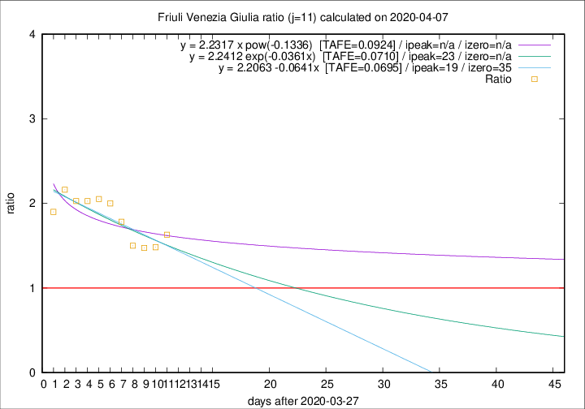

# Friuli Venezia Giulia

Data source: https://raw.githubusercontent.com/pcm-dpc/COVID-19/master/dati-json/dpc-covid19-ita-regioni.json

Estimates in this page were made on 10/4/2020 with data available until 07/04/2020.

## Summary 

### Peak estimate 
|j|linear [TAFE]|exponential [TAFE]|power law [TAFE]|details|
|---|----|-----------|---------|-------|
|7|8/4/2020 [TAFE=0.0914]|8/4/2020 [TAFE=0.0928]|12/4/2020 [TAFE=0.1169]|[analysis](COVID-19_friuli_venezia_giulia_j7_2020-04-07.md)|
|8|11/4/2020 [TAFE=0.1161]|11/4/2020 [TAFE=0.1189]|5/5/2020 [TAFE=0.1406]|[analysis](COVID-19_friuli_venezia_giulia_j8_2020-04-07.md)|
|9|13/4/2020 [TAFE=0.1095]|14/4/2020 [TAFE=0.1081]|27/5/2020 [TAFE=0.1036]|[analysis](COVID-19_friuli_venezia_giulia_j9_2020-04-07.md)|
|10|17/4/2020 [TAFE=0.0944]|20/4/2020 [TAFE=0.0945]|-|[analysis](COVID-19_friuli_venezia_giulia_j10_2020-04-07.md)|
|11|16/4/2020 [TAFE=0.0695]|20/4/2020 [TAFE=0.0710]|-|[analysis](COVID-19_friuli_venezia_giulia_j11_2020-04-07.md)|
|12|10/4/2020 [TAFE=0.1042]|13/4/2020 [TAFE=0.0859]|7/5/2020 [TAFE=0.0744]|[analysis](COVID-19_friuli_venezia_giulia_j12_2020-04-07.md)|
|13|8/4/2020 [TAFE=0.1858]|12/4/2020 [TAFE=0.1070]|30/4/2020 [TAFE=0.0850]|[analysis](COVID-19_friuli_venezia_giulia_j13_2020-04-07.md)|
|14|8/4/2020 [TAFE=0.2713]|12/4/2020 [TAFE=0.1204]|1/5/2020 [TAFE=0.1054]|[analysis](COVID-19_friuli_venezia_giulia_j14_2020-04-07.md)|

Best estimator is linear with j=11 (TAFE=0.0695)
Corresponding peak date estimate is 16/4/2020 (ipeak 19)

Peak date range estimate: 28/3/2020 - 25/5/2020

### End estimate 
|j|linear [TAFE/TFE]|exponential [TAFE/TFE]|power law [TAFE/TFE]|details|
|---|----|-----------|---------|-------|
|7|19/4/2020 [TAFE=0.0914]|-|-|[analysis](COVID-19_friuli_venezia_giulia_j7_2020-04-07.md)|
|8|-|-|-|[analysis](COVID-19_friuli_venezia_giulia_j8_2020-04-07.md)|
|9|-|-|-|[analysis](COVID-19_friuli_venezia_giulia_j9_2020-04-07.md)|
|10|-|-|-|[analysis](COVID-19_friuli_venezia_giulia_j10_2020-04-07.md)|
|11|2/5/2020 [TAFE=0.0695]|-|-|[analysis](COVID-19_friuli_venezia_giulia_j11_2020-04-07.md)|
|12|-|-|-|[analysis](COVID-19_friuli_venezia_giulia_j12_2020-04-07.md)|
|13|-|-|-|[analysis](COVID-19_friuli_venezia_giulia_j13_2020-04-07.md)|
|14|-|-|-|[analysis](COVID-19_friuli_venezia_giulia_j14_2020-04-07.md)|

Best estimator is linear with j=11 (TAFE=0.0695)
Corresponding end date estimate is 2/5/2020 (izero 35)

End date range estimate: 28/3/2020 - 5/5/2020

Generated April 10th, 2020 at 17:26:10 UTC+0200 with https://github.com/robianc/COVID-19
