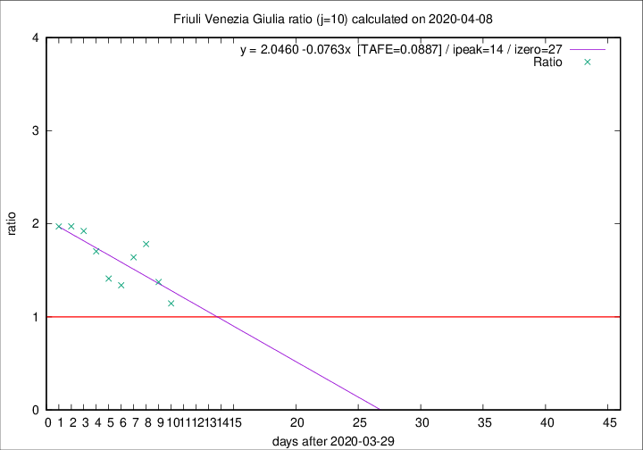

# Friuli Venezia Giulia

Data source: https://raw.githubusercontent.com/pcm-dpc/COVID-19/master/dati-json/dpc-covid19-ita-regioni.json

Delta days analysis (j): 10

Analyses for other values of j for 2020-04-08 are avalable [here](../2020-04-08/README.md)

Analyses for Friuli Venezia Giulia for previous dates are avalable [here](../README.md)

## Fitting 
|fit type|best fit equation|tafe|tfe|ipeak|izero|
|-------|-----|--------|------|---|---|
|linear|y = 2.0460 -0.0763x  [TAFE=0.0887]|0.0887|0.0126|14|27|

## Data
|Date|Daily deaths|Cumulated deaths|Deaths in the last 10 days|Deaths in the 10 days before|ratio|
|----|----------|-----------|-------|--------------------|-----|
|2020-04-08|5|169|71|62|1.1452|
|2020-04-07|6|164|77|56|1.3750|
|2020-04-06|4|158|82|46|1.7826|
|2020-04-05|9|154|82|50|1.6400|
|2020-04-04|9|145|75|56|1.3393|
|2020-04-03|7|136|72|51|1.4118|
|2020-04-02|7|129|75|44|1.7045|
|2020-04-01|9|122|75|39|1.9231|
|2020-03-31|6|113|71|36|1.9722|
|2020-03-30|9|107|69|35|1.9714|

[Download data as CSV](COVID-19_friuli_venezia_giulia_j10_2020-04-08.csv)

Generated April 16th, 2020 at 20:09:19 UTC+0200 with https://github.com/robianc/COVID-19
