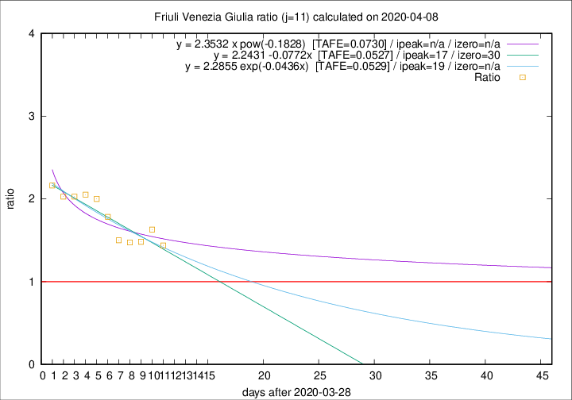

# Friuli Venezia Giulia

Data source: https://raw.githubusercontent.com/pcm-dpc/COVID-19/master/dati-json/dpc-covid19-ita-regioni.json

Delta days analysis (j): 11

Analyses for other values of j for 2020-04-08 are avalable [here](../2020-04-08/README.md)

Analyses for Friuli Venezia Giulia for previous dates are avalable [here](../README.md)

## Fitting 
|fit type|best fit equation|tafe|tfe|ipeak|izero|
|-------|-----|--------|------|---|---|
|linear|y = 2.2431 -0.0772x  [TAFE=0.0527]|0.0527|0.0044|17|30|
|exp|y = 2.2855 exp(-0.0436x)  [TAFE=0.0529]|0.0529|0.0022|19|n/a|
|pow|y = 2.3532 x pow(-0.1828)  [TAFE=0.0730]|0.0730|0.0032|n/a|n/a|

## Data
|Date|Daily deaths|Cumulated deaths|Deaths in the last 11 days|Deaths in the 11 days before|ratio|
|----|----------|-----------|-------|--------------------|-----|
|2020-04-08|5|169|82|57|1.4386|
|2020-04-07|6|164|88|54|1.6296|
|2020-04-06|4|158|86|58|1.4828|
|2020-04-05|9|154|84|57|1.4737|
|2020-04-04|9|145|81|54|1.5000|
|2020-04-03|7|136|82|46|1.7826|
|2020-04-02|7|129|82|41|2.0000|
|2020-04-01|9|122|80|39|2.0513|
|2020-03-31|6|113|75|37|2.0270|
|2020-03-30|9|107|71|35|2.0286|
|2020-03-29|11|98|67|31|2.1613|

[Download data as CSV](COVID-19_friuli_venezia_giulia_j11_2020-04-08.csv)

Generated April 19th, 2020 at 18:42:39 UTC+0200 with https://github.com/robianc/COVID-19
