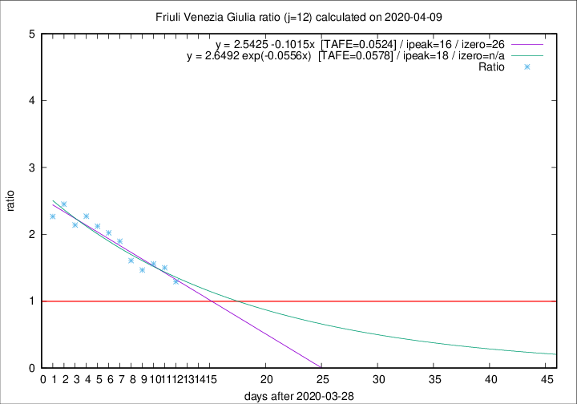

# Friuli Venezia Giulia

Data source: https://raw.githubusercontent.com/pcm-dpc/COVID-19/master/dati-json/dpc-covid19-ita-regioni.json

Delta days analysis (j): 12

## Fitting 
|fit type|best fit equation|tafe|tfe|ipeak|izero|
|-------|-----|--------|------|---|---|
|linear|y = 2.5425 -0.1015x  [TAFE=0.0524]|0.0524|0.0035|16|26|
|exp|y = 2.6492 exp(-0.0556x)  [TAFE=0.0578]|0.0578|0.0018|18|n/a|

## Data
|Date|Daily deaths|Cumulated deaths|Deaths in the last 12 days|Deaths in the 12 days before|ratio|
|----|----------|-----------|-------|--------------------|-----|
|2020-04-09|2|171|84|65|1.2923|
|2020-04-08|5|169|93|62|1.5000|
|2020-04-07|6|164|92|59|1.5593|
|2020-04-06|4|158|88|60|1.4667|
|2020-04-05|9|154|90|56|1.6071|
|2020-04-04|9|145|91|48|1.8958|
|2020-04-03|7|136|89|44|2.0227|
|2020-04-02|7|129|87|41|2.1220|
|2020-04-01|9|122|84|37|2.2703|
|2020-03-31|6|113|77|36|2.1389|
|2020-03-30|9|107|76|31|2.4516|
|2020-03-29|11|98|68|30|2.2667|

[Download data as CSV](COVID-19_friuli_venezia_giulia_j12_2020-04-09.csv)

Generated April 9th, 2020 at 16:40:48 UTC+0200 with https://github.com/robianc/COVID-19
