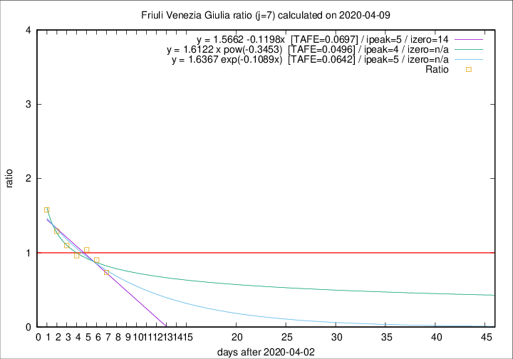

# Friuli Venezia Giulia

Data source: https://raw.githubusercontent.com/pcm-dpc/COVID-19/master/dati-json/dpc-covid19-ita-regioni.json

Estimates in this page were made on 12/4/2020 with data available until 09/04/2020.

## Summary 

### Peak estimate 
|j|linear [TAFE]|exponential [TAFE]|power law [TAFE]|details|
|---|----|-----------|---------|-------|
|7|8/4/2020 [TAFE=0.0697]|8/4/2020 [TAFE=0.0642]|7/4/2020 [TAFE=0.0496]|[analysis](COVID-19_friuli_venezia_giulia_j7_2020-04-09.md)|
|8|9/4/2020 [TAFE=0.0771]|9/4/2020 [TAFE=0.0758]|9/4/2020 [TAFE=0.1231]|[analysis](COVID-19_friuli_venezia_giulia_j8_2020-04-09.md)|
|9|11/4/2020 [TAFE=0.1346]|10/4/2020 [TAFE=0.1357]|16/4/2020 [TAFE=0.1601]|[analysis](COVID-19_friuli_venezia_giulia_j9_2020-04-09.md)|
|10|12/4/2020 [TAFE=0.1064]|12/4/2020 [TAFE=0.1046]|23/4/2020 [TAFE=0.1231]|[analysis](COVID-19_friuli_venezia_giulia_j10_2020-04-09.md)|
|11|13/4/2020 [TAFE=0.0675]|15/4/2020 [TAFE=0.0698]|19/5/2020 [TAFE=0.0883]|[analysis](COVID-19_friuli_venezia_giulia_j11_2020-04-09.md)|
|12|14/4/2020 [TAFE=0.0524]|16/4/2020 [TAFE=0.0578]|9/6/2020 [TAFE=0.0925]|[analysis](COVID-19_friuli_venezia_giulia_j12_2020-04-09.md)|
|13|11/4/2020 [TAFE=0.1255]|14/4/2020 [TAFE=0.0870]|2/5/2020 [TAFE=0.0657]|[analysis](COVID-19_friuli_venezia_giulia_j13_2020-04-09.md)|
|14|10/4/2020 [TAFE=0.1973]|13/4/2020 [TAFE=0.1063]|30/4/2020 [TAFE=0.1063]|[analysis](COVID-19_friuli_venezia_giulia_j14_2020-04-09.md)|

Best estimator is pow with j=7 (TAFE=0.0496)
Corresponding peak date estimate is 7/4/2020 (ipeak 4)

Peak date range estimate: 7/4/2020 - 14/6/2020

### End estimate 
|j|linear [TAFE/TFE]|exponential [TAFE/TFE]|power law [TAFE/TFE]|details|
|---|----|-----------|---------|-------|
|7|17/4/2020 [TAFE=0.0697]|-|-|[analysis](COVID-19_friuli_venezia_giulia_j7_2020-04-09.md)|
|8|-|-|-|[analysis](COVID-19_friuli_venezia_giulia_j8_2020-04-09.md)|
|9|-|-|-|[analysis](COVID-19_friuli_venezia_giulia_j9_2020-04-09.md)|
|10|-|-|-|[analysis](COVID-19_friuli_venezia_giulia_j10_2020-04-09.md)|
|11|25/4/2020 [TAFE=0.0675]|-|-|[analysis](COVID-19_friuli_venezia_giulia_j11_2020-04-09.md)|
|12|24/4/2020 [TAFE=0.0524]|-|-|[analysis](COVID-19_friuli_venezia_giulia_j12_2020-04-09.md)|
|13|-|-|-|[analysis](COVID-19_friuli_venezia_giulia_j13_2020-04-09.md)|
|14|-|-|-|[analysis](COVID-19_friuli_venezia_giulia_j14_2020-04-09.md)|

Best estimator is linear with j=12 (TAFE=0.0524)
Corresponding end date estimate is 24/4/2020 (izero 26)

End date range estimate: 29/3/2020 - 24/4/2020

Generated April 12th, 2020 at 16:28:18 UTC+0200 with https://github.com/robianc/COVID-19
