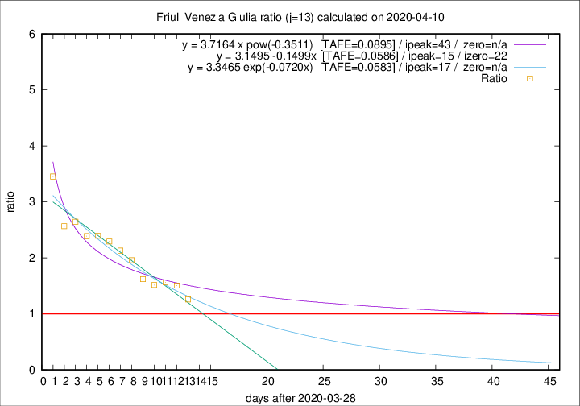

# Friuli Venezia Giulia

Data source: https://raw.githubusercontent.com/pcm-dpc/COVID-19/master/dati-json/dpc-covid19-ita-regioni.json

Delta days analysis (j): 13

Analyses for other values of j for 2020-04-10 are avalable [here](../2020-04-10/README.md)

Analyses for Friuli Venezia Giulia for previous dates are avalable [here](../README.md)

## Fitting 
|fit type|best fit equation|tafe|tfe|ipeak|izero|
|-------|-----|--------|------|---|---|
|linear|y = 3.1495 -0.1499x  [TAFE=0.0586]|0.0586|0.0029|15|22|
|exp|y = 3.3465 exp(-0.0720x)  [TAFE=0.0583]|0.0583|0.0024|17|n/a|
|pow|y = 3.7164 x pow(-0.3511)  [TAFE=0.0895]|0.0895|0.0052|43|n/a|

## Data
|Date|Daily deaths|Cumulated deaths|Deaths in the last 13 days|Deaths in the 13 days before|ratio|
|----|----------|-----------|-------|--------------------|-----|
|2020-04-10|8|179|92|73|1.2603|
|2020-04-09|2|171|95|63|1.5079|
|2020-04-08|5|169|97|62|1.5645|
|2020-04-07|6|164|94|62|1.5161|
|2020-04-06|4|158|94|58|1.6207|
|2020-04-05|9|154|100|51|1.9608|
|2020-04-04|9|145|98|46|2.1304|
|2020-04-03|7|136|94|41|2.2927|
|2020-04-02|7|129|91|38|2.3947|
|2020-04-01|9|122|86|36|2.3889|
|2020-03-31|6|113|82|31|2.6452|
|2020-03-30|9|107|77|30|2.5667|
|2020-03-29|11|98|76|22|3.4545|

[Download data as CSV](COVID-19_friuli_venezia_giulia_j13_2020-04-10.csv)

Generated April 12th, 2020 at 17:02:01 UTC+0200 with https://github.com/robianc/COVID-19
