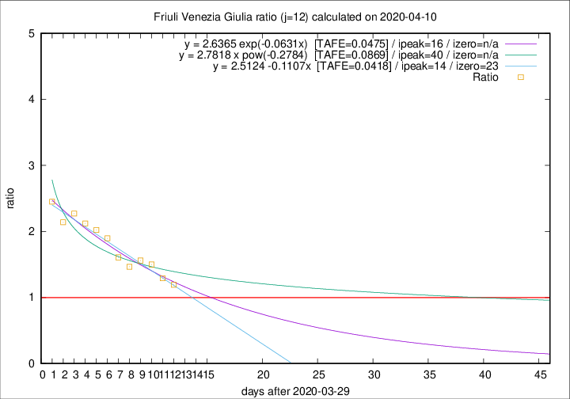

# Friuli Venezia Giulia

Data source: https://raw.githubusercontent.com/pcm-dpc/COVID-19/master/dati-json/dpc-covid19-ita-regioni.json

Estimates in this page were made on 10/4/2020 with data available until 10/04/2020.

## Summary 

### Peak estimate 
|j|linear [TAFE]|exponential [TAFE]|power law [TAFE]|details|
|---|----|-----------|---------|-------|
|7|8/4/2020 [TAFE=0.0543]|8/4/2020 [TAFE=0.0504]|7/4/2020 [TAFE=0.0595]|[analysis](COVID-19_friuli_venezia_giulia_j7_2020-04-10.md)|
|8|9/4/2020 [TAFE=0.0832]|9/4/2020 [TAFE=0.0715]|9/4/2020 [TAFE=0.0769]|[analysis](COVID-19_friuli_venezia_giulia_j8_2020-04-10.md)|
|9|10/4/2020 [TAFE=0.1346]|10/4/2020 [TAFE=0.1343]|12/4/2020 [TAFE=0.1770]|[analysis](COVID-19_friuli_venezia_giulia_j9_2020-04-10.md)|
|10|11/4/2020 [TAFE=0.1091]|12/4/2020 [TAFE=0.1087]|17/4/2020 [TAFE=0.1270]|[analysis](COVID-19_friuli_venezia_giulia_j10_2020-04-10.md)|
|11|12/4/2020 [TAFE=0.0683]|13/4/2020 [TAFE=0.0726]|26/4/2020 [TAFE=0.1038]|[analysis](COVID-19_friuli_venezia_giulia_j11_2020-04-10.md)|
|12|13/4/2020 [TAFE=0.0418]|15/4/2020 [TAFE=0.0475]|9/5/2020 [TAFE=0.0869]|[analysis](COVID-19_friuli_venezia_giulia_j12_2020-04-10.md)|
|13|13/4/2020 [TAFE=0.0586]|15/4/2020 [TAFE=0.0583]|11/5/2020 [TAFE=0.0895]|[analysis](COVID-19_friuli_venezia_giulia_j13_2020-04-10.md)|
|14|11/4/2020 [TAFE=0.1798]|14/4/2020 [TAFE=0.1056]|30/4/2020 [TAFE=0.0959]|[analysis](COVID-19_friuli_venezia_giulia_j14_2020-04-10.md)|

Best estimator is linear with j=12 (TAFE=0.0418)
Corresponding peak date estimate is 13/4/2020 (ipeak 14)

Peak date range estimate: 2/4/2020 - 12/5/2020

### End estimate 
|j|linear [TAFE/TFE]|exponential [TAFE/TFE]|power law [TAFE/TFE]|details|
|---|----|-----------|---------|-------|
|7|19/4/2020 [TAFE=0.0543]|-|-|[analysis](COVID-19_friuli_venezia_giulia_j7_2020-04-10.md)|
|8|-|-|-|[analysis](COVID-19_friuli_venezia_giulia_j8_2020-04-10.md)|
|9|-|-|-|[analysis](COVID-19_friuli_venezia_giulia_j9_2020-04-10.md)|
|10|-|-|-|[analysis](COVID-19_friuli_venezia_giulia_j10_2020-04-10.md)|
|11|-|-|-|[analysis](COVID-19_friuli_venezia_giulia_j11_2020-04-10.md)|
|12|22/4/2020 [TAFE=0.0418]|-|-|[analysis](COVID-19_friuli_venezia_giulia_j12_2020-04-10.md)|
|13|-|-|-|[analysis](COVID-19_friuli_venezia_giulia_j13_2020-04-10.md)|
|14|-|-|-|[analysis](COVID-19_friuli_venezia_giulia_j14_2020-04-10.md)|

Best estimator is linear with j=12 (TAFE=0.0418)
Corresponding end date estimate is 22/4/2020 (izero 23)

End date range estimate: 30/3/2020 - 22/4/2020

Generated April 10th, 2020 at 17:26:10 UTC+0200 with https://github.com/robianc/COVID-19
