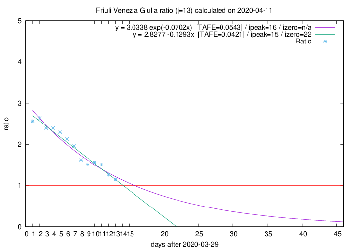

# Friuli Venezia Giulia

Data source: https://raw.githubusercontent.com/pcm-dpc/COVID-19/master/dati-json/dpc-covid19-ita-regioni.json

Estimates in this page were made on 16/4/2020 with data available until 11/04/2020.

## Summary 

### Peak estimate 
|j|linear [TAFE]|exponential [TAFE]|power law [TAFE]|details|
|---|----|-----------|---------|-------|
|7|8/4/2020 [TAFE=0.0485]|8/4/2020 [TAFE=0.0482]|7/4/2020 [TAFE=0.0678]|[analysis](COVID-19_friuli_venezia_giulia_j7_2020-04-11.md)|
|8|10/4/2020 [TAFE=0.1056]|9/4/2020 [TAFE=0.0787]|9/4/2020 [TAFE=0.0307]|[analysis](COVID-19_friuli_venezia_giulia_j8_2020-04-11.md)|
|9|10/4/2020 [TAFE=0.1175]|10/4/2020 [TAFE=0.1100]|10/4/2020 [TAFE=0.1415]|[analysis](COVID-19_friuli_venezia_giulia_j9_2020-04-11.md)|
|10|11/4/2020 [TAFE=0.1071]|11/4/2020 [TAFE=0.1130]|14/4/2020 [TAFE=0.1487]|[analysis](COVID-19_friuli_venezia_giulia_j10_2020-04-11.md)|
|11|12/4/2020 [TAFE=0.0648]|13/4/2020 [TAFE=0.0680]|18/4/2020 [TAFE=0.1050]|[analysis](COVID-19_friuli_venezia_giulia_j11_2020-04-11.md)|
|12|13/4/2020 [TAFE=0.0449]|14/4/2020 [TAFE=0.0517]|28/4/2020 [TAFE=0.1019]|[analysis](COVID-19_friuli_venezia_giulia_j12_2020-04-11.md)|
|13|14/4/2020 [TAFE=0.0421]|15/4/2020 [TAFE=0.0543]|9/5/2020 [TAFE=0.1058]|[analysis](COVID-19_friuli_venezia_giulia_j13_2020-04-11.md)|
|14|12/4/2020 [TAFE=0.1575]|15/4/2020 [TAFE=0.0909]|29/4/2020 [TAFE=0.0784]|[analysis](COVID-19_friuli_venezia_giulia_j14_2020-04-11.md)|

Best estimator is pow with j=8 (TAFE=0.0307)
Corresponding peak date estimate is 9/4/2020 (ipeak 5)

Peak date range estimate: 6/4/2020 - 14/5/2020

### End estimate 
|j|linear [TAFE/TFE]|exponential [TAFE/TFE]|power law [TAFE/TFE]|details|
|---|----|-----------|---------|-------|
|7|22/4/2020 [TAFE=0.0485]|-|-|[analysis](COVID-19_friuli_venezia_giulia_j7_2020-04-11.md)|
|8|-|-|-|[analysis](COVID-19_friuli_venezia_giulia_j8_2020-04-11.md)|
|9|-|-|-|[analysis](COVID-19_friuli_venezia_giulia_j9_2020-04-11.md)|
|10|-|-|-|[analysis](COVID-19_friuli_venezia_giulia_j10_2020-04-11.md)|
|11|-|-|-|[analysis](COVID-19_friuli_venezia_giulia_j11_2020-04-11.md)|
|12|22/4/2020 [TAFE=0.0449]|-|-|[analysis](COVID-19_friuli_venezia_giulia_j12_2020-04-11.md)|
|13|21/4/2020 [TAFE=0.0421]|-|-|[analysis](COVID-19_friuli_venezia_giulia_j13_2020-04-11.md)|
|14|-|-|-|[analysis](COVID-19_friuli_venezia_giulia_j14_2020-04-11.md)|

Best estimator is linear with j=13 (TAFE=0.0421)
Corresponding end date estimate is 21/4/2020 (izero 22)

End date range estimate: 30/3/2020 - 21/4/2020

Generated April 16th, 2020 at 20:09:19 UTC+0200 with https://github.com/robianc/COVID-19
