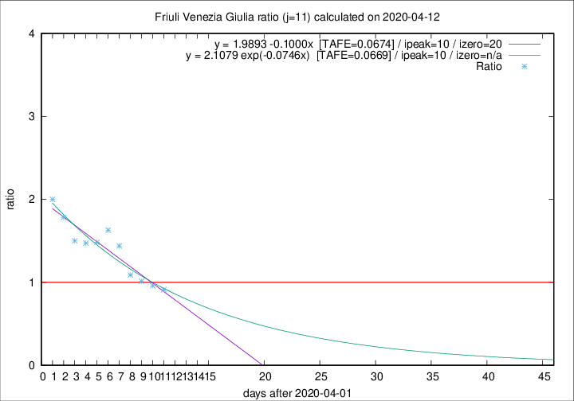

# Friuli Venezia Giulia

Data source: https://raw.githubusercontent.com/pcm-dpc/COVID-19/master/dati-json/dpc-covid19-ita-regioni.json

Delta days analysis (j): 11

Analyses for other values of j for 2020-04-12 are avalable [here](../2020-04-12/README.md)

Analyses for Friuli Venezia Giulia for previous dates are avalable [here](../README.md)

## Fitting 
|fit type|best fit equation|tafe|tfe|ipeak|izero|
|-------|-----|--------|------|---|---|
|linear|y = 1.9893 -0.1000x  [TAFE=0.0674]|0.0674|0.0070|10|20|
|exp|y = 2.1079 exp(-0.0746x)  [TAFE=0.0669]|0.0669|0.0038|10|n/a|

## Data
|Date|Daily deaths|Cumulated deaths|Deaths in the last 11 days|Deaths in the 11 days before|ratio|
|----|----------|-----------|-------|--------------------|-----|
|2020-04-12|10|195|73|80|0.9125|
|2020-04-11|6|185|72|75|0.9600|
|2020-04-10|8|179|72|71|1.0141|
|2020-04-09|2|171|73|67|1.0896|
|2020-04-08|5|169|82|57|1.4386|
|2020-04-07|6|164|88|54|1.6296|
|2020-04-06|4|158|86|58|1.4828|
|2020-04-05|9|154|84|57|1.4737|
|2020-04-04|9|145|81|54|1.5000|
|2020-04-03|7|136|82|46|1.7826|
|2020-04-02|7|129|82|41|2.0000|

[Download data as CSV](COVID-19_friuli_venezia_giulia_j11_2020-04-12.csv)

Generated April 19th, 2020 at 18:42:39 UTC+0200 with https://github.com/robianc/COVID-19
