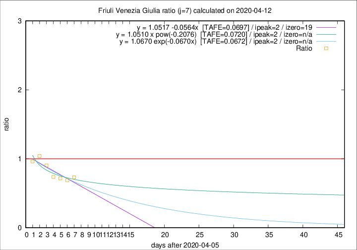

# Friuli Venezia Giulia

Data source: https://raw.githubusercontent.com/pcm-dpc/COVID-19/master/dati-json/dpc-covid19-ita-regioni.json

Delta days analysis (j): 7

Analyses for other values of j for 2020-04-12 are avalable [here](../2020-04-12/README.md)

Analyses for Friuli Venezia Giulia for previous dates are avalable [here](../README.md)

## Fitting 
|fit type|best fit equation|tafe|tfe|ipeak|izero|
|-------|-----|--------|------|---|---|
|linear|y = 1.0517 -0.0564x  [TAFE=0.0697]|0.0697|0.0056|2|19|
|exp|y = 1.0670 exp(-0.0670x)  [TAFE=0.0672]|0.0672|0.0027|2|n/a|
|pow|y = 1.0510 x pow(-0.2076)  [TAFE=0.0720]|0.0720|0.0030|2|n/a|

## Data
|Date|Daily deaths|Cumulated deaths|Deaths in the last 7 days|Deaths in the 7 days before|ratio|
|----|----------|-----------|-------|--------------------|-----|
|2020-04-12|10|195|41|56|0.7321|
|2020-04-11|6|185|40|58|0.6897|
|2020-04-10|8|179|43|60|0.7167|
|2020-04-09|2|171|42|57|0.7368|
|2020-04-08|5|169|47|52|0.9038|
|2020-04-07|6|164|51|49|1.0408|
|2020-04-06|4|158|51|53|0.9623|

[Download data as CSV](COVID-19_friuli_venezia_giulia_j7_2020-04-12.csv)

Generated April 19th, 2020 at 18:42:39 UTC+0200 with https://github.com/robianc/COVID-19
