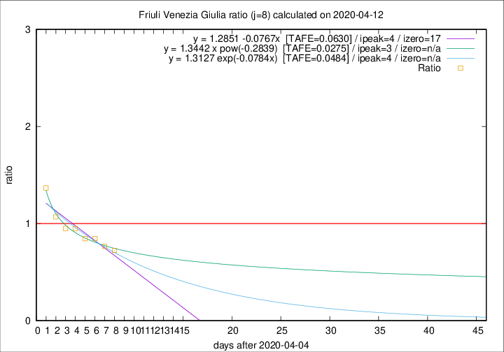

# Friuli Venezia Giulia

Data source: https://raw.githubusercontent.com/pcm-dpc/COVID-19/master/dati-json/dpc-covid19-ita-regioni.json

Delta days analysis (j): 8

Analyses for other values of j for 2020-04-12 are avalable [here](../2020-04-12/README.md)

Analyses for Friuli Venezia Giulia for previous dates are avalable [here](../README.md)

## Fitting 
|fit type|best fit equation|tafe|tfe|ipeak|izero|
|-------|-----|--------|------|---|---|
|linear|y = 1.2851 -0.0767x  [TAFE=0.0630]|0.0630|0.0032|4|17|
|exp|y = 1.3127 exp(-0.0784x)  [TAFE=0.0484]|0.0484|0.0017|4|n/a|
|pow|y = 1.3442 x pow(-0.2839)  [TAFE=0.0275]|0.0275|0.0006|3|n/a|

## Data
|Date|Daily deaths|Cumulated deaths|Deaths in the last 8 days|Deaths in the 8 days before|ratio|
|----|----------|-----------|-------|--------------------|-----|
|2020-04-12|10|195|50|69|0.7246|
|2020-04-11|6|185|49|64|0.7656|
|2020-04-10|8|179|50|59|0.8475|
|2020-04-09|2|171|49|58|0.8448|
|2020-04-08|5|169|56|59|0.9492|
|2020-04-07|6|164|57|60|0.9500|
|2020-04-06|4|158|60|56|1.0714|
|2020-04-05|9|154|67|49|1.3673|

[Download data as CSV](COVID-19_friuli_venezia_giulia_j8_2020-04-12.csv)

Generated April 12th, 2020 at 17:02:01 UTC+0200 with https://github.com/robianc/COVID-19
