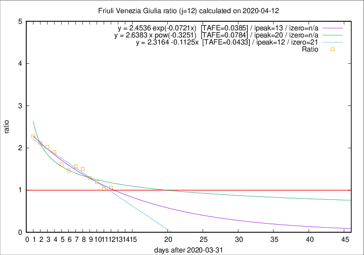

# Friuli Venezia Giulia

Data source: https://raw.githubusercontent.com/pcm-dpc/COVID-19/master/dati-json/dpc-covid19-ita-regioni.json

Estimates in this page were made on 16/4/2020 with data available until 12/04/2020.

## Summary 

### Peak estimate 
|j|linear [TAFE]|exponential [TAFE]|power law [TAFE]|details|
|---|----|-----------|---------|-------|
|7|8/4/2020 [TAFE=0.0697]|8/4/2020 [TAFE=0.0672]|8/4/2020 [TAFE=0.0720]|[analysis](COVID-19_friuli_venezia_giulia_j7_2020-04-12.md)|
|8|9/4/2020 [TAFE=0.0630]|9/4/2020 [TAFE=0.0484]|8/4/2020 [TAFE=0.0275]|[analysis](COVID-19_friuli_venezia_giulia_j8_2020-04-12.md)|
|9|11/4/2020 [TAFE=0.1282]|11/4/2020 [TAFE=0.1032]|10/4/2020 [TAFE=0.0799]|[analysis](COVID-19_friuli_venezia_giulia_j9_2020-04-12.md)|
|10|12/4/2020 [TAFE=0.1172]|11/4/2020 [TAFE=0.1146]|12/4/2020 [TAFE=0.1567]|[analysis](COVID-19_friuli_venezia_giulia_j10_2020-04-12.md)|
|11|12/4/2020 [TAFE=0.0674]|12/4/2020 [TAFE=0.0669]|15/4/2020 [TAFE=0.0997]|[analysis](COVID-19_friuli_venezia_giulia_j11_2020-04-12.md)|
|12|13/4/2020 [TAFE=0.0433]|14/4/2020 [TAFE=0.0385]|21/4/2020 [TAFE=0.0784]|[analysis](COVID-19_friuli_venezia_giulia_j12_2020-04-12.md)|
|13|14/4/2020 [TAFE=0.0447]|15/4/2020 [TAFE=0.0467]|29/4/2020 [TAFE=0.0998]|[analysis](COVID-19_friuli_venezia_giulia_j13_2020-04-12.md)|
|14|14/4/2020 [TAFE=0.0744]|16/4/2020 [TAFE=0.0588]|3/5/2020 [TAFE=0.1080]|[analysis](COVID-19_friuli_venezia_giulia_j14_2020-04-12.md)|

Best estimator is pow with j=8 (TAFE=0.0275)
Corresponding peak date estimate is 8/4/2020 (ipeak 3)

Peak date range estimate: 7/4/2020 - 9/5/2020

### End estimate 
|j|linear [TAFE/TFE]|exponential [TAFE/TFE]|power law [TAFE/TFE]|details|
|---|----|-----------|---------|-------|
|7|25/4/2020 [TAFE=0.0697]|-|-|[analysis](COVID-19_friuli_venezia_giulia_j7_2020-04-12.md)|
|8|22/4/2020 [TAFE=0.0630]|-|-|[analysis](COVID-19_friuli_venezia_giulia_j8_2020-04-12.md)|
|9|-|-|-|[analysis](COVID-19_friuli_venezia_giulia_j9_2020-04-12.md)|
|10|-|-|-|[analysis](COVID-19_friuli_venezia_giulia_j10_2020-04-12.md)|
|11|-|-|-|[analysis](COVID-19_friuli_venezia_giulia_j11_2020-04-12.md)|
|12|22/4/2020 [TAFE=0.0433]|-|-|[analysis](COVID-19_friuli_venezia_giulia_j12_2020-04-12.md)|
|13|-|-|-|[analysis](COVID-19_friuli_venezia_giulia_j13_2020-04-12.md)|
|14|-|-|-|[analysis](COVID-19_friuli_venezia_giulia_j14_2020-04-12.md)|

Best estimator is linear with j=12 (TAFE=0.0433)
Corresponding end date estimate is 22/4/2020 (izero 21)

End date range estimate: 1/4/2020 - 22/4/2020

Generated April 16th, 2020 at 20:09:19 UTC+0200 with https://github.com/robianc/COVID-19
