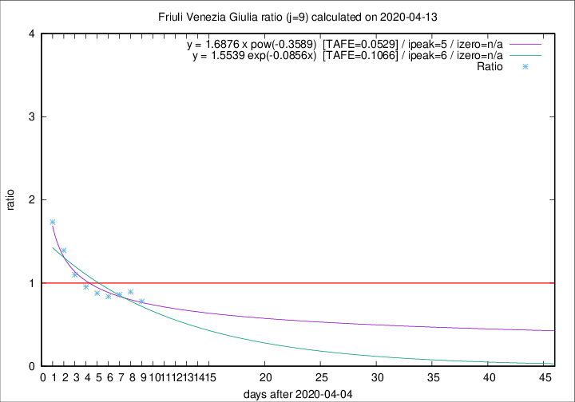

# Friuli Venezia Giulia

Data source: https://raw.githubusercontent.com/pcm-dpc/COVID-19/master/dati-json/dpc-covid19-ita-regioni.json

Delta days analysis (j): 9

Analyses for other values of j for 2020-04-13 are avalable [here](../2020-04-13/README.md)

Analyses for Friuli Venezia Giulia for previous dates are avalable [here](../README.md)

## Fitting 
|fit type|best fit equation|tafe|tfe|ipeak|izero|
|-------|-----|--------|------|---|---|
|exp|y = 1.5539 exp(-0.0856x)  [TAFE=0.1066]|0.1066|0.0070|6|n/a|
|pow|y = 1.6876 x pow(-0.3589)  [TAFE=0.0529]|0.0529|0.0018|5|n/a|

## Data
|Date|Daily deaths|Cumulated deaths|Deaths in the last 9 days|Deaths in the 9 days before|ratio|
|----|----------|-----------|-------|--------------------|-----|
|2020-04-13|7|202|57|73|0.7808|
|2020-04-12|10|195|59|66|0.8939|
|2020-04-11|6|185|56|65|0.8615|
|2020-04-10|8|179|57|68|0.8382|
|2020-04-09|2|171|58|66|0.8788|
|2020-04-08|5|169|62|65|0.9538|
|2020-04-07|6|164|66|60|1.1000|
|2020-04-06|4|158|71|51|1.3922|
|2020-04-05|9|154|78|45|1.7333|

[Download data as CSV](COVID-19_friuli_venezia_giulia_j9_2020-04-13.csv)

Generated April 14th, 2020 at 19:16:04 UTC+0200 with https://github.com/robianc/COVID-19
