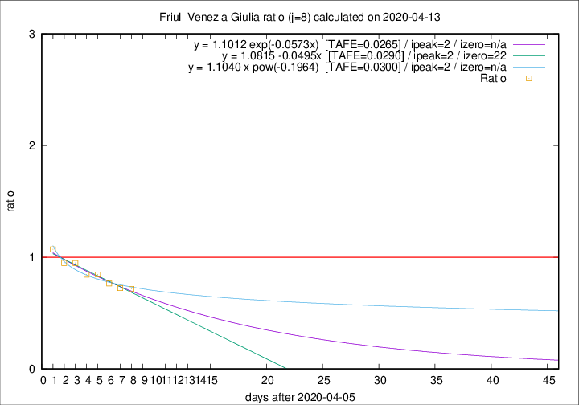

# Friuli Venezia Giulia

Data source: https://raw.githubusercontent.com/pcm-dpc/COVID-19/master/dati-json/dpc-covid19-ita-regioni.json

Estimates in this page were made on 16/4/2020 with data available until 13/04/2020.

## Summary 

### Peak estimate 
|j|linear [TAFE]|exponential [TAFE]|power law [TAFE]|details|
|---|----|-----------|---------|-------|
|7|9/4/2020 [TAFE=0.1078]|9/4/2020 [TAFE=0.1057]|9/4/2020 [TAFE=0.0810]|[analysis](COVID-19_friuli_venezia_giulia_j7_2020-04-13.md)|
|8|8/4/2020 [TAFE=0.0290]|8/4/2020 [TAFE=0.0265]|8/4/2020 [TAFE=0.0300]|[analysis](COVID-19_friuli_venezia_giulia_j8_2020-04-13.md)|
|9|11/4/2020 [TAFE=0.1326]|11/4/2020 [TAFE=0.1066]|10/4/2020 [TAFE=0.0529]|[analysis](COVID-19_friuli_venezia_giulia_j9_2020-04-13.md)|
|10|12/4/2020 [TAFE=0.1261]|12/4/2020 [TAFE=0.1147]|12/4/2020 [TAFE=0.1323]|[analysis](COVID-19_friuli_venezia_giulia_j10_2020-04-13.md)|
|11|13/4/2020 [TAFE=0.0711]|13/4/2020 [TAFE=0.0671]|14/4/2020 [TAFE=0.1058]|[analysis](COVID-19_friuli_venezia_giulia_j11_2020-04-13.md)|
|12|13/4/2020 [TAFE=0.0497]|14/4/2020 [TAFE=0.0386]|18/4/2020 [TAFE=0.0785]|[analysis](COVID-19_friuli_venezia_giulia_j12_2020-04-13.md)|
|13|14/4/2020 [TAFE=0.0539]|15/4/2020 [TAFE=0.0468]|25/4/2020 [TAFE=0.0952]|[analysis](COVID-19_friuli_venezia_giulia_j13_2020-04-13.md)|
|14|15/4/2020 [TAFE=0.0580]|16/4/2020 [TAFE=0.0525]|2/5/2020 [TAFE=0.1197]|[analysis](COVID-19_friuli_venezia_giulia_j14_2020-04-13.md)|

Best estimator is exp with j=8 (TAFE=0.0265)
Corresponding peak date estimate is 8/4/2020 (ipeak 2)

Peak date range estimate: 8/4/2020 - 8/5/2020

### End estimate 
|j|linear [TAFE/TFE]|exponential [TAFE/TFE]|power law [TAFE/TFE]|details|
|---|----|-----------|---------|-------|
|7|6/5/2020 [TAFE=0.1078]|-|-|[analysis](COVID-19_friuli_venezia_giulia_j7_2020-04-13.md)|
|8|28/4/2020 [TAFE=0.0290]|-|-|[analysis](COVID-19_friuli_venezia_giulia_j8_2020-04-13.md)|
|9|-|-|-|[analysis](COVID-19_friuli_venezia_giulia_j9_2020-04-13.md)|
|10|-|-|-|[analysis](COVID-19_friuli_venezia_giulia_j10_2020-04-13.md)|
|11|-|-|-|[analysis](COVID-19_friuli_venezia_giulia_j11_2020-04-13.md)|
|12|-|-|-|[analysis](COVID-19_friuli_venezia_giulia_j12_2020-04-13.md)|
|13|-|-|-|[analysis](COVID-19_friuli_venezia_giulia_j13_2020-04-13.md)|
|14|-|-|-|[analysis](COVID-19_friuli_venezia_giulia_j14_2020-04-13.md)|

Best estimator is linear with j=8 (TAFE=0.0290)
Corresponding end date estimate is 28/4/2020 (izero 22)

End date range estimate: 6/4/2020 - 5/5/2020

Generated April 16th, 2020 at 20:09:19 UTC+0200 with https://github.com/robianc/COVID-19
