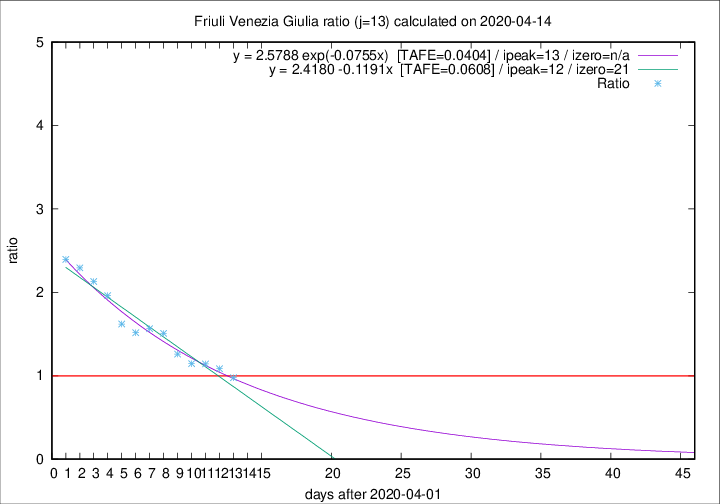

# Friuli Venezia Giulia

Data source: https://raw.githubusercontent.com/pcm-dpc/COVID-19/master/dati-json/dpc-covid19-ita-regioni.json

Delta days analysis (j): 13

Analyses for other values of j for 2020-04-14 are avalable [here](../2020-04-14/README.md)

Analyses for Friuli Venezia Giulia for previous dates are avalable [here](../README.md)

## Fitting 
|fit type|best fit equation|tafe|tfe|ipeak|izero|
|-------|-----|--------|------|---|---|
|linear|y = 2.4180 -0.1191x  [TAFE=0.0608]|0.0608|0.0009|12|21|
|exp|y = 2.5788 exp(-0.0755x)  [TAFE=0.0404]|0.0404|0.0008|13|n/a|

## Data
|Date|Daily deaths|Cumulated deaths|Deaths in the last 13 days|Deaths in the 13 days before|ratio|
|----|----------|-----------|-------|--------------------|-----|
|2020-04-14|4|206|84|86|0.9767|
|2020-04-13|7|202|89|82|1.0854|
|2020-04-12|10|195|88|77|1.1429|
|2020-04-11|6|185|87|76|1.1447|
|2020-04-10|8|179|92|73|1.2603|
|2020-04-09|2|171|95|63|1.5079|
|2020-04-08|5|169|97|62|1.5645|
|2020-04-07|6|164|94|62|1.5161|
|2020-04-06|4|158|94|58|1.6207|
|2020-04-05|9|154|100|51|1.9608|
|2020-04-04|9|145|98|46|2.1304|
|2020-04-03|7|136|94|41|2.2927|
|2020-04-02|7|129|91|38|2.3947|

[Download data as CSV](COVID-19_friuli_venezia_giulia_j13_2020-04-14.csv)

Generated April 16th, 2020 at 20:09:19 UTC+0200 with https://github.com/robianc/COVID-19
