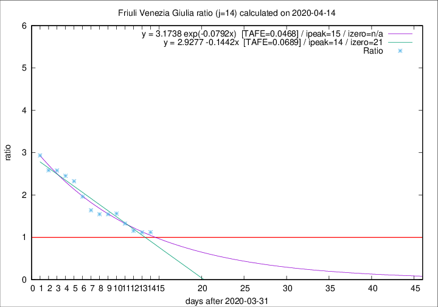

# Friuli Venezia Giulia

Data source: https://raw.githubusercontent.com/pcm-dpc/COVID-19/master/dati-json/dpc-covid19-ita-regioni.json

Delta days analysis (j): 14

Analyses for other values of j for 2020-04-14 are avalable [here](../2020-04-14/README.md)

Analyses for Friuli Venezia Giulia for previous dates are avalable [here](../README.md)

## Fitting 
|fit type|best fit equation|tafe|tfe|ipeak|izero|
|-------|-----|--------|------|---|---|
|linear|y = 2.9277 -0.1442x  [TAFE=0.0689]|0.0689|0.0016|14|21|
|exp|y = 3.1738 exp(-0.0792x)  [TAFE=0.0468]|0.0468|0.0019|15|n/a|

## Data
|Date|Daily deaths|Cumulated deaths|Deaths in the last 14 days|Deaths in the 14 days before|ratio|
|----|----------|-----------|-------|--------------------|-----|
|2020-04-14|4|206|93|83|1.1205|
|2020-04-13|7|202|95|85|1.1176|
|2020-04-12|10|195|97|84|1.1548|
|2020-04-11|6|185|98|74|1.3243|
|2020-04-10|8|179|103|66|1.5606|
|2020-04-09|2|171|99|64|1.5469|
|2020-04-08|5|169|99|64|1.5469|
|2020-04-07|6|164|100|61|1.6393|
|2020-04-06|4|158|104|53|1.9623|
|2020-04-05|9|154|107|46|2.3261|
|2020-04-04|9|145|103|42|2.4524|
|2020-04-03|7|136|98|38|2.5789|
|2020-04-02|7|129|93|36|2.5833|
|2020-04-01|9|122|91|31|2.9355|

[Download data as CSV](COVID-19_friuli_venezia_giulia_j14_2020-04-14.csv)

Generated April 14th, 2020 at 19:16:04 UTC+0200 with https://github.com/robianc/COVID-19
