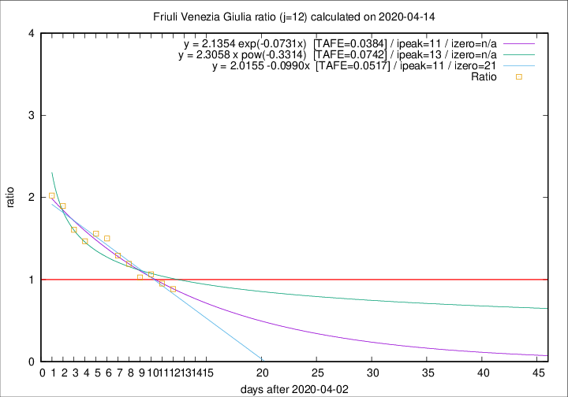
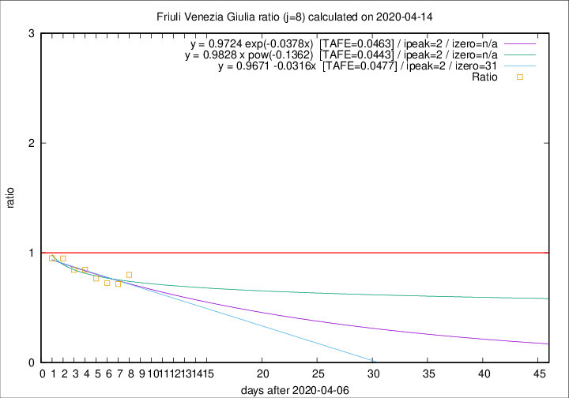

# Friuli Venezia Giulia

Data source: https://raw.githubusercontent.com/pcm-dpc/COVID-19/master/dati-json/dpc-covid19-ita-regioni.json

Estimates in this page were made on 14/4/2020 with data available until 14/04/2020.

## Summary 

### Peak estimate 
|j|linear [TAFE]|exponential [TAFE]|power law [TAFE]|details|
|---|----|-----------|---------|-------|
|7|10/4/2020 [TAFE=0.0894]|10/4/2020 [TAFE=0.0878]|10/4/2020 [TAFE=0.0900]|[analysis](COVID-19_friuli_venezia_giulia_j7_2020-04-14.md)|
|8|9/4/2020 [TAFE=0.0477]|9/4/2020 [TAFE=0.0463]|9/4/2020 [TAFE=0.0443]|[analysis](COVID-19_friuli_venezia_giulia_j8_2020-04-14.md)|
|9|10/4/2020 [TAFE=0.0784]|10/4/2020 [TAFE=0.0736]|9/4/2020 [TAFE=0.0512]|[analysis](COVID-19_friuli_venezia_giulia_j9_2020-04-14.md)|
|10|12/4/2020 [TAFE=0.1261]|12/4/2020 [TAFE=0.1004]|11/4/2020 [TAFE=0.0786]|[analysis](COVID-19_friuli_venezia_giulia_j10_2020-04-14.md)|
|11|13/4/2020 [TAFE=0.0760]|13/4/2020 [TAFE=0.0705]|13/4/2020 [TAFE=0.1039]|[analysis](COVID-19_friuli_venezia_giulia_j11_2020-04-14.md)|
|12|14/4/2020 [TAFE=0.0517]|14/4/2020 [TAFE=0.0384]|16/4/2020 [TAFE=0.0742]|[analysis](COVID-19_friuli_venezia_giulia_j12_2020-04-14.md)|
|13|14/4/2020 [TAFE=0.0608]|15/4/2020 [TAFE=0.0404]|20/4/2020 [TAFE=0.0803]|[analysis](COVID-19_friuli_venezia_giulia_j13_2020-04-14.md)|
|14|15/4/2020 [TAFE=0.0689]|16/4/2020 [TAFE=0.0468]|26/4/2020 [TAFE=0.1023]|[analysis](COVID-19_friuli_venezia_giulia_j14_2020-04-14.md)|

Best estimator is exp with j=12 (TAFE=0.0384)
Corresponding peak date estimate is 14/4/2020 (ipeak 11)

Peak date range estimate: 5/4/2020 - 28/4/2020

### End estimate 
|j|linear [TAFE/TFE]|exponential [TAFE/TFE]|power law [TAFE/TFE]|details|
|---|----|-----------|---------|-------|
|7|-|-|-|[analysis](COVID-19_friuli_venezia_giulia_j7_2020-04-14.md)|
|8|8/5/2020 [TAFE=0.0477]|-|-|[analysis](COVID-19_friuli_venezia_giulia_j8_2020-04-14.md)|
|9|-|-|-|[analysis](COVID-19_friuli_venezia_giulia_j9_2020-04-14.md)|
|10|-|-|-|[analysis](COVID-19_friuli_venezia_giulia_j10_2020-04-14.md)|
|11|-|-|-|[analysis](COVID-19_friuli_venezia_giulia_j11_2020-04-14.md)|
|12|-|-|-|[analysis](COVID-19_friuli_venezia_giulia_j12_2020-04-14.md)|
|13|-|-|-|[analysis](COVID-19_friuli_venezia_giulia_j13_2020-04-14.md)|
|14|-|-|-|[analysis](COVID-19_friuli_venezia_giulia_j14_2020-04-14.md)|

Best estimator is linear with j=8 (TAFE=0.0477)
Corresponding end date estimate is 8/5/2020 (izero 31)

End date range estimate: 7/4/2020 - 8/5/2020

Generated April 14th, 2020 at 19:16:04 UTC+0200 with https://github.com/robianc/COVID-19
