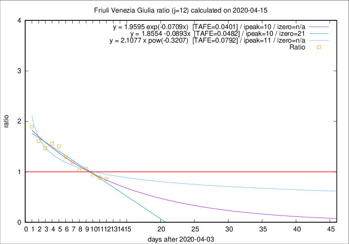

# Friuli Venezia Giulia

Data source: https://raw.githubusercontent.com/pcm-dpc/COVID-19/master/dati-json/dpc-covid19-ita-regioni.json

Delta days analysis (j): 12

Analyses for other values of j for 2020-04-15 are avalable [here](../2020-04-15/README.md)

Analyses for Friuli Venezia Giulia for previous dates are avalable [here](../README.md)

## Fitting 
|fit type|best fit equation|tafe|tfe|ipeak|izero|
|-------|-----|--------|------|---|---|
|linear|y = 1.8554 -0.0893x  [TAFE=0.0482]|0.0482|0.0021|10|21|
|exp|y = 1.9595 exp(-0.0709x)  [TAFE=0.0401]|0.0401|0.0015|10|n/a|
|pow|y = 2.1077 x pow(-0.3207)  [TAFE=0.0792]|0.0792|0.0041|11|n/a|

## Data
|Date|Daily deaths|Cumulated deaths|Deaths in the last 12 days|Deaths in the 12 days before|ratio|
|----|----------|-----------|-------|--------------------|-----|
|2020-04-15|6|212|76|89|0.8539|
|2020-04-14|4|206|77|87|0.8851|
|2020-04-13|7|202|80|84|0.9524|
|2020-04-12|10|195|82|77|1.0649|
|2020-04-11|6|185|78|76|1.0263|
|2020-04-10|8|179|81|68|1.1912|
|2020-04-09|2|171|84|65|1.2923|
|2020-04-08|5|169|93|62|1.5000|
|2020-04-07|6|164|92|59|1.5593|
|2020-04-06|4|158|88|60|1.4667|
|2020-04-05|9|154|90|56|1.6071|
|2020-04-04|9|145|91|48|1.8958|

[Download data as CSV](COVID-19_friuli_venezia_giulia_j12_2020-04-15.csv)

Generated April 16th, 2020 at 20:09:19 UTC+0200 with https://github.com/robianc/COVID-19
