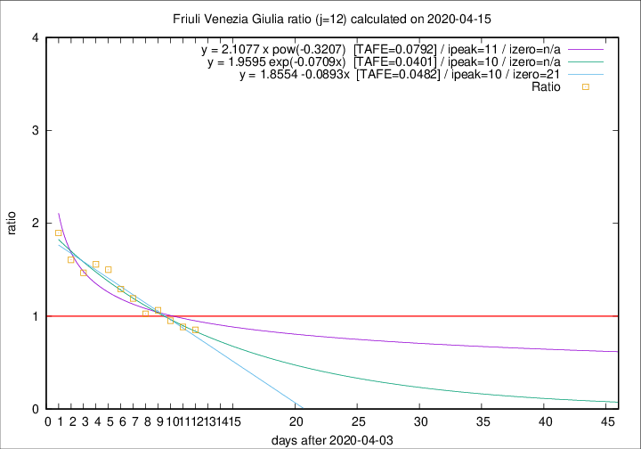

# Friuli Venezia Giulia

Data source: https://raw.githubusercontent.com/pcm-dpc/COVID-19/master/dati-json/dpc-covid19-ita-regioni.json

Estimates in this page were made on 16/4/2020 with data available until 15/04/2020.

## Summary 

### Peak estimate 
|j|linear [TAFE]|exponential [TAFE]|power law [TAFE]|details|
|---|----|-----------|---------|-------|
|7|11/4/2020 [TAFE=0.0499]|11/4/2020 [TAFE=0.0481]|11/4/2020 [TAFE=0.0630]|[analysis](COVID-19_friuli_venezia_giulia_j7_2020-04-15.md)|
|8|10/4/2020 [TAFE=0.0659]|10/4/2020 [TAFE=0.0649]|10/4/2020 [TAFE=0.0557]|[analysis](COVID-19_friuli_venezia_giulia_j8_2020-04-15.md)|
|9|9/4/2020 [TAFE=0.0571]|9/4/2020 [TAFE=0.0561]|9/4/2020 [TAFE=0.0429]|[analysis](COVID-19_friuli_venezia_giulia_j9_2020-04-15.md)|
|10|12/4/2020 [TAFE=0.1283]|12/4/2020 [TAFE=0.0979]|11/4/2020 [TAFE=0.0546]|[analysis](COVID-19_friuli_venezia_giulia_j10_2020-04-15.md)|
|11|13/4/2020 [TAFE=0.0818]|13/4/2020 [TAFE=0.0687]|12/4/2020 [TAFE=0.0809]|[analysis](COVID-19_friuli_venezia_giulia_j11_2020-04-15.md)|
|12|14/4/2020 [TAFE=0.0482]|14/4/2020 [TAFE=0.0401]|15/4/2020 [TAFE=0.0792]|[analysis](COVID-19_friuli_venezia_giulia_j12_2020-04-15.md)|
|13|15/4/2020 [TAFE=0.0619]|15/4/2020 [TAFE=0.0408]|18/4/2020 [TAFE=0.0678]|[analysis](COVID-19_friuli_venezia_giulia_j13_2020-04-15.md)|
|14|15/4/2020 [TAFE=0.0733]|16/4/2020 [TAFE=0.0485]|23/4/2020 [TAFE=0.0973]|[analysis](COVID-19_friuli_venezia_giulia_j14_2020-04-15.md)|

Best estimator is exp with j=12 (TAFE=0.0401)
Corresponding peak date estimate is 14/4/2020 (ipeak 10)

Peak date range estimate: 6/4/2020 - 25/4/2020

### End estimate 
|j|linear [TAFE/TFE]|exponential [TAFE/TFE]|power law [TAFE/TFE]|details|
|---|----|-----------|---------|-------|
|7|-|-|-|[analysis](COVID-19_friuli_venezia_giulia_j7_2020-04-15.md)|
|8|31/5/2020 [TAFE=0.0659]|-|-|[analysis](COVID-19_friuli_venezia_giulia_j8_2020-04-15.md)|
|9|4/5/2020 [TAFE=0.0571]|-|-|[analysis](COVID-19_friuli_venezia_giulia_j9_2020-04-15.md)|
|10|-|-|-|[analysis](COVID-19_friuli_venezia_giulia_j10_2020-04-15.md)|
|11|-|-|-|[analysis](COVID-19_friuli_venezia_giulia_j11_2020-04-15.md)|
|12|25/4/2020 [TAFE=0.0482]|-|-|[analysis](COVID-19_friuli_venezia_giulia_j12_2020-04-15.md)|
|13|-|-|-|[analysis](COVID-19_friuli_venezia_giulia_j13_2020-04-15.md)|
|14|-|-|-|[analysis](COVID-19_friuli_venezia_giulia_j14_2020-04-15.md)|

Best estimator is linear with j=12 (TAFE=0.0482)
Corresponding end date estimate is 25/4/2020 (izero 21)

End date range estimate: 4/4/2020 - 27/5/2020

Generated April 16th, 2020 at 20:09:19 UTC+0200 with https://github.com/robianc/COVID-19
