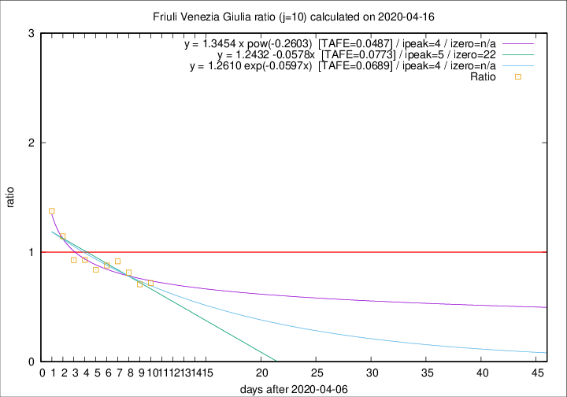

# Friuli Venezia Giulia

Data source: https://raw.githubusercontent.com/pcm-dpc/COVID-19/master/dati-json/dpc-covid19-ita-regioni.json

Delta days analysis (j): 10

Analyses for other values of j for 2020-04-16 are avalable [here](../2020-04-16/README.md)

Analyses for Friuli Venezia Giulia for previous dates are avalable [here](../README.md)

## Fitting 
|fit type|best fit equation|tafe|tfe|ipeak|izero|
|-------|-----|--------|------|---|---|
|linear|y = 1.2432 -0.0578x  [TAFE=0.0773]|0.0773|0.0065|5|22|
|exp|y = 1.2610 exp(-0.0597x)  [TAFE=0.0689]|0.0689|0.0035|4|n/a|
|pow|y = 1.3454 x pow(-0.2603)  [TAFE=0.0487]|0.0487|0.0018|4|n/a|

## Data
|Date|Daily deaths|Cumulated deaths|Deaths in the last 10 days|Deaths in the 10 days before|ratio|
|----|----------|-----------|-------|--------------------|-----|
|2020-04-16|5|217|59|82|0.7195|
|2020-04-15|6|212|58|82|0.7073|
|2020-04-14|4|206|61|75|0.8133|
|2020-04-13|7|202|66|72|0.9167|
|2020-04-12|10|195|66|75|0.8800|
|2020-04-11|6|185|63|75|0.8400|
|2020-04-10|8|179|66|71|0.9296|
|2020-04-09|2|171|64|69|0.9275|
|2020-04-08|5|169|71|62|1.1452|
|2020-04-07|6|164|77|56|1.3750|

[Download data as CSV](COVID-19_friuli_venezia_giulia_j10_2020-04-16.csv)

Generated April 19th, 2020 at 18:42:39 UTC+0200 with https://github.com/robianc/COVID-19
