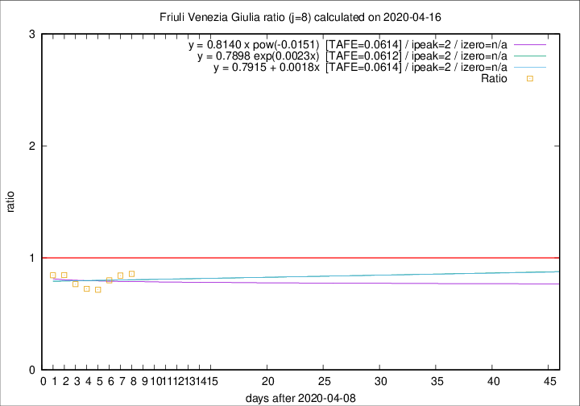

# Friuli Venezia Giulia

Data source: https://raw.githubusercontent.com/pcm-dpc/COVID-19/master/dati-json/dpc-covid19-ita-regioni.json

Delta days analysis (j): 8

Analyses for other values of j for 2020-04-16 are avalable [here](../2020-04-16/README.md)

Analyses for Friuli Venezia Giulia for previous dates are avalable [here](../README.md)

## Fitting 
|fit type|best fit equation|tafe|tfe|ipeak|izero|
|-------|-----|--------|------|---|---|
|linear|y = 0.7915 + 0.0018x  [TAFE=0.0614]|0.0614|0.0045|2|n/a|
|exp|y = 0.7898 exp(0.0023x)  [TAFE=0.0612]|0.0612|0.0025|2|n/a|
|pow|y = 0.8140 x pow(-0.0151)  [TAFE=0.0614]|0.0614|0.0022|2|n/a|

## Data
|Date|Daily deaths|Cumulated deaths|Deaths in the last 8 days|Deaths in the 8 days before|ratio|
|----|----------|-----------|-------|--------------------|-----|
|2020-04-16|5|217|48|56|0.8571|
|2020-04-15|6|212|48|57|0.8421|
|2020-04-14|4|206|48|60|0.8000|
|2020-04-13|7|202|48|67|0.7164|
|2020-04-12|10|195|50|69|0.7246|
|2020-04-11|6|185|49|64|0.7656|
|2020-04-10|8|179|50|59|0.8475|
|2020-04-09|2|171|49|58|0.8448|

[Download data as CSV](COVID-19_friuli_venezia_giulia_j8_2020-04-16.csv)

Generated April 19th, 2020 at 18:42:39 UTC+0200 with https://github.com/robianc/COVID-19
