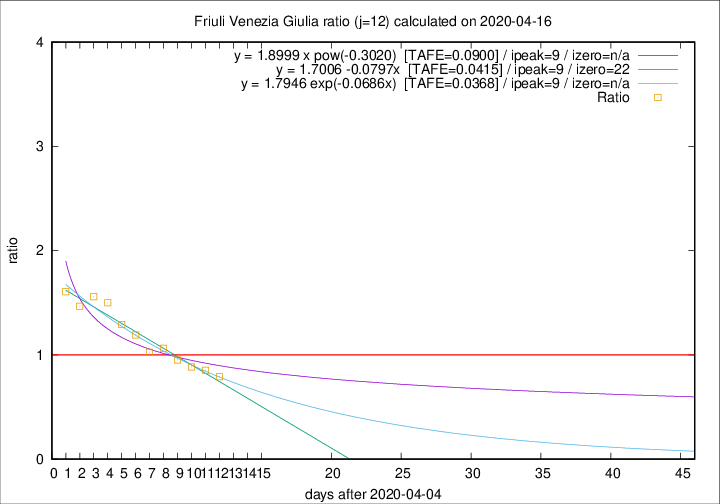

# Friuli Venezia Giulia

Data source: https://raw.githubusercontent.com/pcm-dpc/COVID-19/master/dati-json/dpc-covid19-ita-regioni.json

Estimates in this page were made on 16/4/2020 with data available until 16/04/2020.

## Summary 

### Peak estimate 
|j|linear [TAFE]|exponential [TAFE]|power law [TAFE]|details|
|---|----|-----------|---------|-------|
|7|12/4/2020 [TAFE=0.0593]|12/4/2020 [TAFE=0.0545]|12/4/2020 [TAFE=0.0721]|[analysis](COVID-19_friuli_venezia_giulia_j7_2020-04-16.md)|
|8|11/4/2020 [TAFE=0.0614]|11/4/2020 [TAFE=0.0612]|11/4/2020 [TAFE=0.0614]|[analysis](COVID-19_friuli_venezia_giulia_j8_2020-04-16.md)|
|9|10/4/2020 [TAFE=0.0528]|10/4/2020 [TAFE=0.0523]|10/4/2020 [TAFE=0.0465]|[analysis](COVID-19_friuli_venezia_giulia_j9_2020-04-16.md)|
|10|12/4/2020 [TAFE=0.0773]|11/4/2020 [TAFE=0.0689]|11/4/2020 [TAFE=0.0487]|[analysis](COVID-19_friuli_venezia_giulia_j10_2020-04-16.md)|
|11|13/4/2020 [TAFE=0.0896]|13/4/2020 [TAFE=0.0688]|12/4/2020 [TAFE=0.0570]|[analysis](COVID-19_friuli_venezia_giulia_j11_2020-04-16.md)|
|12|14/4/2020 [TAFE=0.0415]|14/4/2020 [TAFE=0.0368]|14/4/2020 [TAFE=0.0900]|[analysis](COVID-19_friuli_venezia_giulia_j12_2020-04-16.md)|
|13|15/4/2020 [TAFE=0.0566]|15/4/2020 [TAFE=0.0388]|17/4/2020 [TAFE=0.0662]|[analysis](COVID-19_friuli_venezia_giulia_j13_2020-04-16.md)|
|14|16/4/2020 [TAFE=0.0855]|16/4/2020 [TAFE=0.0491]|20/4/2020 [TAFE=0.0811]|[analysis](COVID-19_friuli_venezia_giulia_j14_2020-04-16.md)|

Best estimator is exp with j=12 (TAFE=0.0368)
Corresponding peak date estimate is 14/4/2020 (ipeak 9)

Peak date range estimate: 7/4/2020 - 22/4/2020

### End estimate 
|j|linear [TAFE/TFE]|exponential [TAFE/TFE]|power law [TAFE/TFE]|details|
|---|----|-----------|---------|-------|
|7|-|-|-|[analysis](COVID-19_friuli_venezia_giulia_j7_2020-04-16.md)|
|8|-|-|-|[analysis](COVID-19_friuli_venezia_giulia_j8_2020-04-16.md)|
|9|19/5/2020 [TAFE=0.0528]|-|-|[analysis](COVID-19_friuli_venezia_giulia_j9_2020-04-16.md)|
|10|-|-|-|[analysis](COVID-19_friuli_venezia_giulia_j10_2020-04-16.md)|
|11|-|-|-|[analysis](COVID-19_friuli_venezia_giulia_j11_2020-04-16.md)|
|12|27/4/2020 [TAFE=0.0415]|-|-|[analysis](COVID-19_friuli_venezia_giulia_j12_2020-04-16.md)|
|13|-|-|-|[analysis](COVID-19_friuli_venezia_giulia_j13_2020-04-16.md)|
|14|-|-|-|[analysis](COVID-19_friuli_venezia_giulia_j14_2020-04-16.md)|

Best estimator is linear with j=12 (TAFE=0.0415)
Corresponding end date estimate is 27/4/2020 (izero 22)

End date range estimate: 5/4/2020 - 16/5/2020

Generated April 16th, 2020 at 20:09:19 UTC+0200 with https://github.com/robianc/COVID-19
