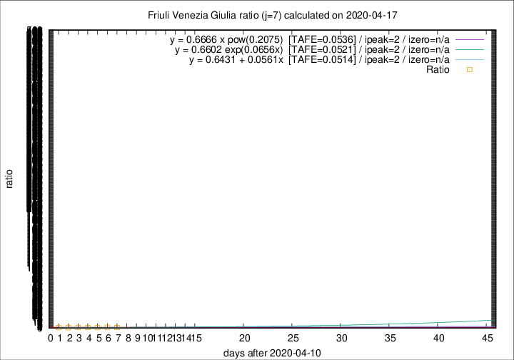

# Friuli Venezia Giulia

Data source: https://raw.githubusercontent.com/pcm-dpc/COVID-19/master/dati-json/dpc-covid19-ita-regioni.json

Delta days analysis (j): 7

Analyses for other values of j for 2020-04-17 are avalable [here](../2020-04-17/README.md)

Analyses for Friuli Venezia Giulia for previous dates are avalable [here](../README.md)

## Fitting 
|fit type|best fit equation|tafe|tfe|ipeak|izero|
|-------|-----|--------|------|---|---|
|linear|y = 0.6431 + 0.0561x  [TAFE=0.0514]|0.0514|0.0042|2|n/a|
|exp|y = 0.6602 exp(0.0656x)  [TAFE=0.0521]|0.0521|0.0022|2|n/a|
|pow|y = 0.6666 x pow(0.2075)  [TAFE=0.0536]|0.0536|0.0021|2|n/a|

## Data
|Date|Daily deaths|Cumulated deaths|Deaths in the last 7 days|Deaths in the 7 days before|ratio|
|----|----------|-----------|-------|--------------------|-----|
|2020-04-17|3|220|41|43|0.9535|
|2020-04-16|5|217|46|42|1.0952|
|2020-04-15|6|212|43|47|0.9149|
|2020-04-14|4|206|42|51|0.8235|
|2020-04-13|7|202|44|51|0.8627|
|2020-04-12|10|195|41|56|0.7321|
|2020-04-11|6|185|40|58|0.6897|

[Download data as CSV](COVID-19_friuli_venezia_giulia_j7_2020-04-17.csv)

Generated April 19th, 2020 at 18:42:39 UTC+0200 with https://github.com/robianc/COVID-19
