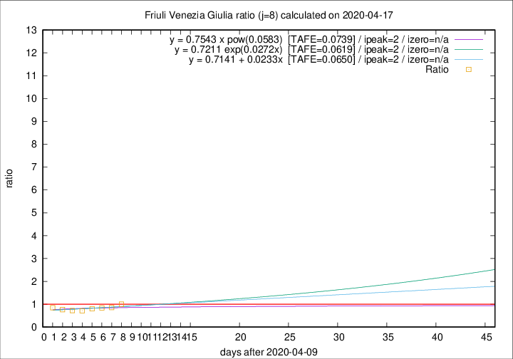

# Friuli Venezia Giulia

Data source: https://raw.githubusercontent.com/pcm-dpc/COVID-19/master/dati-json/dpc-covid19-ita-regioni.json

Delta days analysis (j): 8

Analyses for other values of j for 2020-04-17 are avalable [here](../2020-04-17/README.md)

Analyses for Friuli Venezia Giulia for previous dates are avalable [here](../README.md)

## Fitting 
|fit type|best fit equation|tafe|tfe|ipeak|izero|
|-------|-----|--------|------|---|---|
|linear|y = 0.7141 + 0.0233x  [TAFE=0.0650]|0.0650|0.0061|2|n/a|
|exp|y = 0.7211 exp(0.0272x)  [TAFE=0.0619]|0.0619|0.0032|2|n/a|
|pow|y = 0.7543 x pow(0.0583)  [TAFE=0.0739]|0.0739|0.0043|2|n/a|

## Data
|Date|Daily deaths|Cumulated deaths|Deaths in the last 8 days|Deaths in the 8 days before|ratio|
|----|----------|-----------|-------|--------------------|-----|
|2020-04-17|3|220|49|49|1.0000|
|2020-04-16|5|217|48|56|0.8571|
|2020-04-15|6|212|48|57|0.8421|
|2020-04-14|4|206|48|60|0.8000|
|2020-04-13|7|202|48|67|0.7164|
|2020-04-12|10|195|50|69|0.7246|
|2020-04-11|6|185|49|64|0.7656|
|2020-04-10|8|179|50|59|0.8475|

[Download data as CSV](COVID-19_friuli_venezia_giulia_j8_2020-04-17.csv)

Generated April 19th, 2020 at 18:42:39 UTC+0200 with https://github.com/robianc/COVID-19
