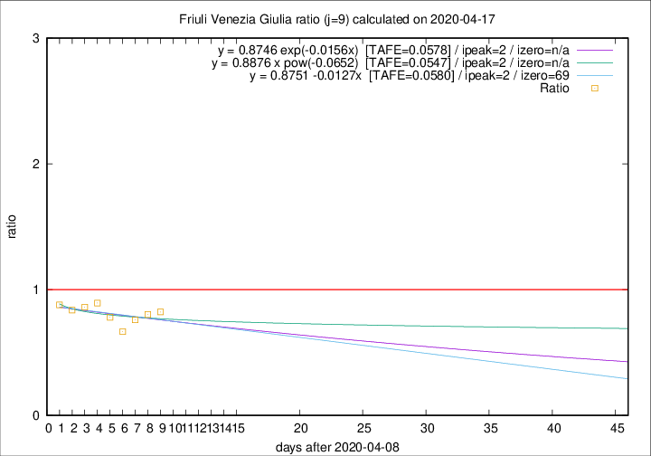

# Friuli Venezia Giulia

Data source: https://raw.githubusercontent.com/pcm-dpc/COVID-19/master/dati-json/dpc-covid19-ita-regioni.json

Delta days analysis (j): 9

Analyses for other values of j for 2020-04-17 are avalable [here](../2020-04-17/README.md)

Analyses for Friuli Venezia Giulia for previous dates are avalable [here](../README.md)

## Fitting 
|fit type|best fit equation|tafe|tfe|ipeak|izero|
|-------|-----|--------|------|---|---|
|linear|y = 0.8751 -0.0127x  [TAFE=0.0580]|0.0580|0.0054|2|69|
|exp|y = 0.8746 exp(-0.0156x)  [TAFE=0.0578]|0.0578|0.0029|2|n/a|
|pow|y = 0.8876 x pow(-0.0652)  [TAFE=0.0547]|0.0547|0.0027|2|n/a|

## Data
|Date|Daily deaths|Cumulated deaths|Deaths in the last 9 days|Deaths in the 9 days before|ratio|
|----|----------|-----------|-------|--------------------|-----|
|2020-04-17|3|220|51|62|0.8226|
|2020-04-16|5|217|53|66|0.8030|
|2020-04-15|6|212|54|71|0.7606|
|2020-04-14|4|206|52|78|0.6667|
|2020-04-13|7|202|57|73|0.7808|
|2020-04-12|10|195|59|66|0.8939|
|2020-04-11|6|185|56|65|0.8615|
|2020-04-10|8|179|57|68|0.8382|
|2020-04-09|2|171|58|66|0.8788|

[Download data as CSV](COVID-19_friuli_venezia_giulia_j9_2020-04-17.csv)

Generated April 19th, 2020 at 18:42:39 UTC+0200 with https://github.com/robianc/COVID-19
