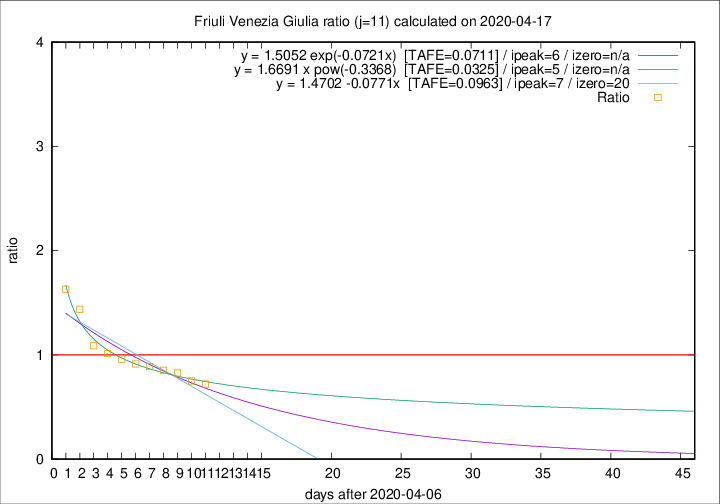
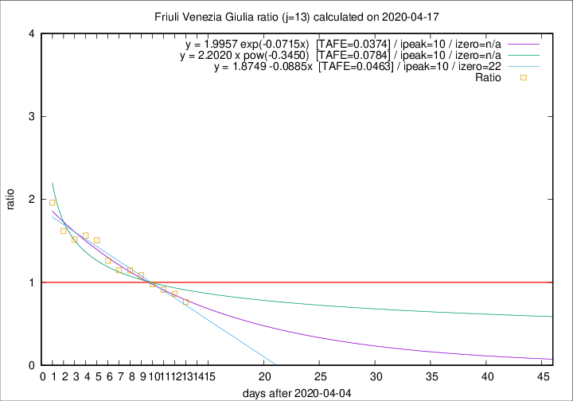

# Friuli Venezia Giulia

Data source: https://raw.githubusercontent.com/pcm-dpc/COVID-19/master/dati-json/dpc-covid19-ita-regioni.json

Estimates in this page were made on 19/4/2020 with data available until 17/04/2020.

## Summary 

### Peak estimate 
|j|linear [TAFE]|exponential [TAFE]|power law [TAFE]|details|
|---|----|-----------|---------|-------|
|7|13/4/2020 [TAFE=0.0514]|13/4/2020 [TAFE=0.0521]|13/4/2020 [TAFE=0.0536]|[analysis](COVID-19_friuli_venezia_giulia_j7_2020-04-17.md)|
|8|12/4/2020 [TAFE=0.0650]|12/4/2020 [TAFE=0.0619]|12/4/2020 [TAFE=0.0739]|[analysis](COVID-19_friuli_venezia_giulia_j8_2020-04-17.md)|
|9|11/4/2020 [TAFE=0.0580]|11/4/2020 [TAFE=0.0578]|11/4/2020 [TAFE=0.0547]|[analysis](COVID-19_friuli_venezia_giulia_j9_2020-04-17.md)|
|10|10/4/2020 [TAFE=0.0533]|10/4/2020 [TAFE=0.0525]|10/4/2020 [TAFE=0.0473]|[analysis](COVID-19_friuli_venezia_giulia_j10_2020-04-17.md)|
|11|14/4/2020 [TAFE=0.0963]|13/4/2020 [TAFE=0.0711]|12/4/2020 [TAFE=0.0325]|[analysis](COVID-19_friuli_venezia_giulia_j11_2020-04-17.md)|
|12|14/4/2020 [TAFE=0.0466]|14/4/2020 [TAFE=0.0335]|13/4/2020 [TAFE=0.0819]|[analysis](COVID-19_friuli_venezia_giulia_j12_2020-04-17.md)|
|13|15/4/2020 [TAFE=0.0463]|15/4/2020 [TAFE=0.0374]|15/4/2020 [TAFE=0.0784]|[analysis](COVID-19_friuli_venezia_giulia_j13_2020-04-17.md)|
|14|16/4/2020 [TAFE=0.0824]|16/4/2020 [TAFE=0.0472]|18/4/2020 [TAFE=0.0725]|[analysis](COVID-19_friuli_venezia_giulia_j14_2020-04-17.md)|

Best estimator is pow with j=11 (TAFE=0.0325)
Corresponding peak date estimate is 12/4/2020 (ipeak 5)

Peak date range estimate: 9/4/2020 - 21/4/2020

### End estimate 
|j|linear [TAFE/TFE]|exponential [TAFE/TFE]|power law [TAFE/TFE]|details|
|---|----|-----------|---------|-------|
|7|-|-|-|[analysis](COVID-19_friuli_venezia_giulia_j7_2020-04-17.md)|
|8|-|-|-|[analysis](COVID-19_friuli_venezia_giulia_j8_2020-04-17.md)|
|9|17/6/2020 [TAFE=0.0580]|-|-|[analysis](COVID-19_friuli_venezia_giulia_j9_2020-04-17.md)|
|10|6/5/2020 [TAFE=0.0533]|-|-|[analysis](COVID-19_friuli_venezia_giulia_j10_2020-04-17.md)|
|11|-|-|-|[analysis](COVID-19_friuli_venezia_giulia_j11_2020-04-17.md)|
|12|27/4/2020 [TAFE=0.0466]|-|-|[analysis](COVID-19_friuli_venezia_giulia_j12_2020-04-17.md)|
|13|27/4/2020 [TAFE=0.0463]|-|-|[analysis](COVID-19_friuli_venezia_giulia_j13_2020-04-17.md)|
|14|-|-|-|[analysis](COVID-19_friuli_venezia_giulia_j14_2020-04-17.md)|

Best estimator is linear with j=13 (TAFE=0.0463)
Corresponding end date estimate is 27/4/2020 (izero 22)

End date range estimate: 5/4/2020 - 13/6/2020

Generated April 19th, 2020 at 18:42:39 UTC+0200 with https://github.com/robianc/COVID-19
