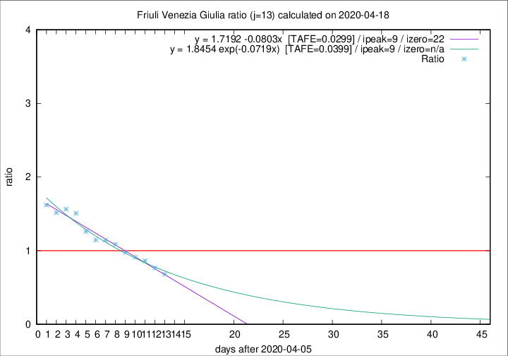

# Friuli Venezia Giulia

Data source: https://raw.githubusercontent.com/pcm-dpc/COVID-19/master/dati-json/dpc-covid19-ita-regioni.json

Estimates in this page were made on 19/4/2020 with data available until 18/04/2020.

## Summary 

### Peak estimate 
|j|linear [TAFE]|exponential [TAFE]|power law [TAFE]|details|
|---|----|-----------|---------|-------|
|7|14/4/2020 [TAFE=0.0635]|14/4/2020 [TAFE=0.0650]|14/4/2020 [TAFE=0.0522]|[analysis](COVID-19_friuli_venezia_giulia_j7_2020-04-18.md)|
|8|13/4/2020 [TAFE=0.0478]|13/4/2020 [TAFE=0.0467]|13/4/2020 [TAFE=0.0537]|[analysis](COVID-19_friuli_venezia_giulia_j8_2020-04-18.md)|
|9|12/4/2020 [TAFE=0.0660]|12/4/2020 [TAFE=0.0662]|12/4/2020 [TAFE=0.0634]|[analysis](COVID-19_friuli_venezia_giulia_j9_2020-04-18.md)|
|10|11/4/2020 [TAFE=0.0421]|11/4/2020 [TAFE=0.0426]|11/4/2020 [TAFE=0.0511]|[analysis](COVID-19_friuli_venezia_giulia_j10_2020-04-18.md)|
|11|13/4/2020 [TAFE=0.0579]|13/4/2020 [TAFE=0.0431]|12/4/2020 [TAFE=0.0356]|[analysis](COVID-19_friuli_venezia_giulia_j11_2020-04-18.md)|
|12|15/4/2020 [TAFE=0.0539]|14/4/2020 [TAFE=0.0308]|13/4/2020 [TAFE=0.0521]|[analysis](COVID-19_friuli_venezia_giulia_j12_2020-04-18.md)|
|13|15/4/2020 [TAFE=0.0299]|15/4/2020 [TAFE=0.0399]|14/4/2020 [TAFE=0.1001]|[analysis](COVID-19_friuli_venezia_giulia_j13_2020-04-18.md)|
|14|16/4/2020 [TAFE=0.0677]|16/4/2020 [TAFE=0.0448]|17/4/2020 [TAFE=0.0745]|[analysis](COVID-19_friuli_venezia_giulia_j14_2020-04-18.md)|

Best estimator is linear with j=13 (TAFE=0.0299)
Corresponding peak date estimate is 15/4/2020 (ipeak 9)

Peak date range estimate: 8/4/2020 - 18/4/2020

### End estimate 
|j|linear [TAFE/TFE]|exponential [TAFE/TFE]|power law [TAFE/TFE]|details|
|---|----|-----------|---------|-------|
|7|-|-|-|[analysis](COVID-19_friuli_venezia_giulia_j7_2020-04-18.md)|
|8|-|-|-|[analysis](COVID-19_friuli_venezia_giulia_j8_2020-04-18.md)|
|9|-|-|-|[analysis](COVID-19_friuli_venezia_giulia_j9_2020-04-18.md)|
|10|17/5/2020 [TAFE=0.0421]|-|-|[analysis](COVID-19_friuli_venezia_giulia_j10_2020-04-18.md)|
|11|-|-|-|[analysis](COVID-19_friuli_venezia_giulia_j11_2020-04-18.md)|
|12|-|-|-|[analysis](COVID-19_friuli_venezia_giulia_j12_2020-04-18.md)|
|13|28/4/2020 [TAFE=0.0299]|-|-|[analysis](COVID-19_friuli_venezia_giulia_j13_2020-04-18.md)|
|14|-|-|-|[analysis](COVID-19_friuli_venezia_giulia_j14_2020-04-18.md)|

Best estimator is linear with j=13 (TAFE=0.0299)
Corresponding end date estimate is 28/4/2020 (izero 22)

End date range estimate: 6/4/2020 - 14/5/2020

Generated April 19th, 2020 at 18:42:39 UTC+0200 with https://github.com/robianc/COVID-19
