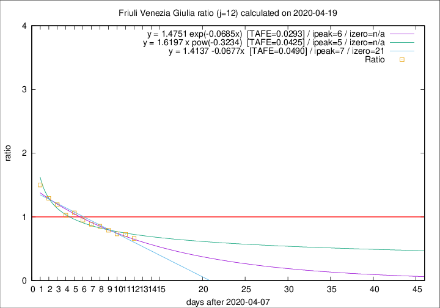

# Friuli Venezia Giulia

Data source: https://raw.githubusercontent.com/pcm-dpc/COVID-19/master/dati-json/dpc-covid19-ita-regioni.json

Delta days analysis (j): 12

Analyses for other values of j for 2020-04-19 are avalable [here](../2020-04-19/README.md)

Analyses for Friuli Venezia Giulia for previous dates are avalable [here](../README.md)

## Fitting 
|fit type|best fit equation|tafe|tfe|ipeak|izero|
|-------|-----|--------|------|---|---|
|linear|y = 1.4137 -0.0677x  [TAFE=0.0490]|0.0490|0.0013|7|21|
|exp|y = 1.4751 exp(-0.0685x)  [TAFE=0.0293]|0.0293|0.0007|6|n/a|
|pow|y = 1.6197 x pow(-0.3234)  [TAFE=0.0425]|0.0425|0.0014|5|n/a|

## Data
|Date|Daily deaths|Cumulated deaths|Deaths in the last 12 days|Deaths in the 12 days before|ratio|
|----|----------|-----------|-------|--------------------|-----|
|2020-04-19|3|225|61|92|0.6630|
|2020-04-18|2|222|64|88|0.7273|
|2020-04-17|3|220|66|90|0.7333|
|2020-04-16|5|217|72|91|0.7912|
|2020-04-15|6|212|76|89|0.8539|
|2020-04-14|4|206|77|87|0.8851|
|2020-04-13|7|202|80|84|0.9524|
|2020-04-12|10|195|82|77|1.0649|
|2020-04-11|6|185|78|76|1.0263|
|2020-04-10|8|179|81|68|1.1912|
|2020-04-09|2|171|84|65|1.2923|
|2020-04-08|5|169|93|62|1.5000|

[Download data as CSV](COVID-19_friuli_venezia_giulia_j12_2020-04-19.csv)

Generated April 19th, 2020 at 18:42:39 UTC+0200 with https://github.com/robianc/COVID-19
