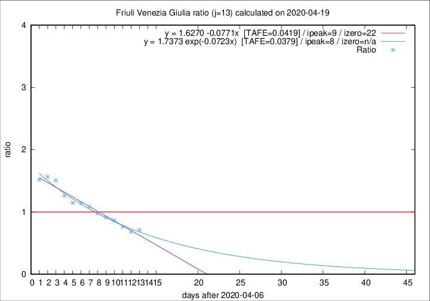

# Friuli Venezia Giulia

Data source: https://raw.githubusercontent.com/pcm-dpc/COVID-19/master/dati-json/dpc-covid19-ita-regioni.json

Delta days analysis (j): 13

Analyses for other values of j for 2020-04-19 are avalable [here](../2020-04-19/README.md)

Analyses for Friuli Venezia Giulia for previous dates are avalable [here](../README.md)

## Fitting 
|fit type|best fit equation|tafe|tfe|ipeak|izero|
|-------|-----|--------|------|---|---|
|linear|y = 1.6270 -0.0771x  [TAFE=0.0419]|0.0419|0.0014|9|22|
|exp|y = 1.7373 exp(-0.0723x)  [TAFE=0.0379]|0.0379|0.0010|8|n/a|

## Data
|Date|Daily deaths|Cumulated deaths|Deaths in the last 13 days|Deaths in the 13 days before|ratio|
|----|----------|-----------|-------|--------------------|-----|
|2020-04-19|3|225|67|94|0.7128|
|2020-04-18|2|222|68|100|0.6800|
|2020-04-17|3|220|75|98|0.7653|
|2020-04-16|5|217|81|94|0.8617|
|2020-04-15|6|212|83|91|0.9121|
|2020-04-14|4|206|84|86|0.9767|
|2020-04-13|7|202|89|82|1.0854|
|2020-04-12|10|195|88|77|1.1429|
|2020-04-11|6|185|87|76|1.1447|
|2020-04-10|8|179|92|73|1.2603|
|2020-04-09|2|171|95|63|1.5079|
|2020-04-08|5|169|97|62|1.5645|
|2020-04-07|6|164|94|62|1.5161|

[Download data as CSV](COVID-19_friuli_venezia_giulia_j13_2020-04-19.csv)

Generated April 19th, 2020 at 18:42:39 UTC+0200 with https://github.com/robianc/COVID-19
