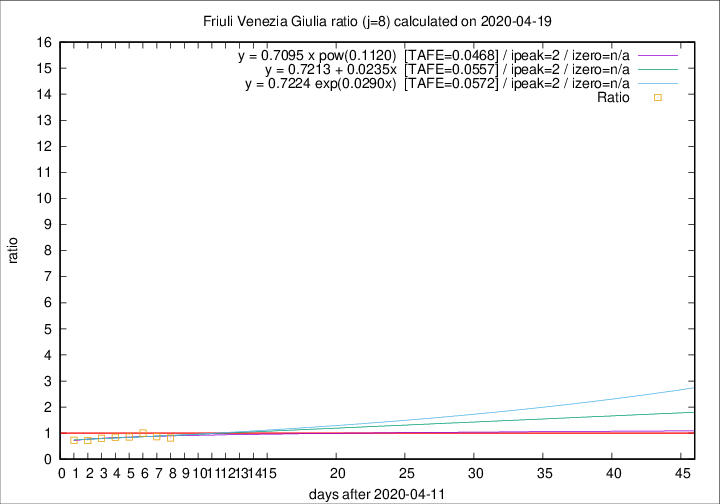

# Friuli Venezia Giulia

Data source: https://raw.githubusercontent.com/pcm-dpc/COVID-19/master/dati-json/dpc-covid19-ita-regioni.json

Delta days analysis (j): 8

Analyses for other values of j for 2020-04-19 are avalable [here](../2020-04-19/README.md)

Analyses for Friuli Venezia Giulia for previous dates are avalable [here](../README.md)

## Fitting 
|fit type|best fit equation|tafe|tfe|ipeak|izero|
|-------|-----|--------|------|---|---|
|linear|y = 0.7213 + 0.0235x  [TAFE=0.0557]|0.0557|0.0054|2|n/a|
|exp|y = 0.7224 exp(0.0290x)  [TAFE=0.0572]|0.0572|0.0028|2|n/a|
|pow|y = 0.7095 x pow(0.1120)  [TAFE=0.0468]|0.0468|0.0022|2|n/a|

## Data
|Date|Daily deaths|Cumulated deaths|Deaths in the last 8 days|Deaths in the 8 days before|ratio|
|----|----------|-----------|-------|--------------------|-----|
|2020-04-19|3|225|40|49|0.8163|
|2020-04-18|2|222|43|50|0.8600|
|2020-04-17|3|220|49|49|1.0000|
|2020-04-16|5|217|48|56|0.8571|
|2020-04-15|6|212|48|57|0.8421|
|2020-04-14|4|206|48|60|0.8000|
|2020-04-13|7|202|48|67|0.7164|
|2020-04-12|10|195|50|69|0.7246|

[Download data as CSV](COVID-19_friuli_venezia_giulia_j8_2020-04-19.csv)

Generated April 19th, 2020 at 18:42:39 UTC+0200 with https://github.com/robianc/COVID-19
