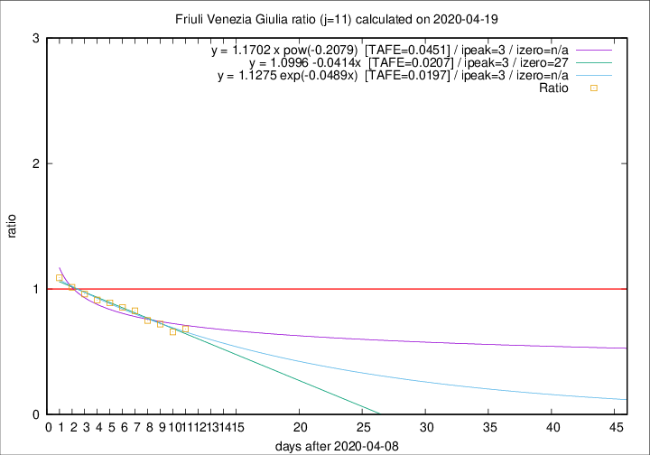

# Friuli Venezia Giulia

Data source: https://raw.githubusercontent.com/pcm-dpc/COVID-19/master/dati-json/dpc-covid19-ita-regioni.json

Estimates in this page were made on 19/4/2020 with data available until 19/04/2020.

## Summary 

### Peak estimate 
|j|linear [TAFE]|exponential [TAFE]|power law [TAFE]|details|
|---|----|-----------|---------|-------|
|7|15/4/2020 [TAFE=0.0949]|15/4/2020 [TAFE=0.0963]|15/4/2020 [TAFE=0.0906]|[analysis](COVID-19_friuli_venezia_giulia_j7_2020-04-19.md)|
|8|14/4/2020 [TAFE=0.0557]|14/4/2020 [TAFE=0.0572]|14/4/2020 [TAFE=0.0468]|[analysis](COVID-19_friuli_venezia_giulia_j8_2020-04-19.md)|
|9|13/4/2020 [TAFE=0.0639]|13/4/2020 [TAFE=0.0638]|13/4/2020 [TAFE=0.0639]|[analysis](COVID-19_friuli_venezia_giulia_j9_2020-04-19.md)|
|10|12/4/2020 [TAFE=0.0626]|12/4/2020 [TAFE=0.0613]|12/4/2020 [TAFE=0.0582]|[analysis](COVID-19_friuli_venezia_giulia_j10_2020-04-19.md)|
|11|12/4/2020 [TAFE=0.0207]|12/4/2020 [TAFE=0.0197]|12/4/2020 [TAFE=0.0451]|[analysis](COVID-19_friuli_venezia_giulia_j11_2020-04-19.md)|
|12|15/4/2020 [TAFE=0.0490]|14/4/2020 [TAFE=0.0293]|13/4/2020 [TAFE=0.0425]|[analysis](COVID-19_friuli_venezia_giulia_j12_2020-04-19.md)|
|13|16/4/2020 [TAFE=0.0419]|15/4/2020 [TAFE=0.0379]|14/4/2020 [TAFE=0.0923]|[analysis](COVID-19_friuli_venezia_giulia_j13_2020-04-19.md)|
|14|17/4/2020 [TAFE=0.0425]|16/4/2020 [TAFE=0.0449]|16/4/2020 [TAFE=0.1031]|[analysis](COVID-19_friuli_venezia_giulia_j14_2020-04-19.md)|

Best estimator is exp with j=11 (TAFE=0.0197)
Corresponding peak date estimate is 12/4/2020 (ipeak 3)

Peak date range estimate: 11/4/2020 - 20/4/2020

### End estimate 
|j|linear [TAFE/TFE]|exponential [TAFE/TFE]|power law [TAFE/TFE]|details|
|---|----|-----------|---------|-------|
|7|-|-|-|[analysis](COVID-19_friuli_venezia_giulia_j7_2020-04-19.md)|
|8|-|-|-|[analysis](COVID-19_friuli_venezia_giulia_j8_2020-04-19.md)|
|9|-|-|-|[analysis](COVID-19_friuli_venezia_giulia_j9_2020-04-19.md)|
|10|1/6/2020 [TAFE=0.0626]|-|-|[analysis](COVID-19_friuli_venezia_giulia_j10_2020-04-19.md)|
|11|6/5/2020 [TAFE=0.0207]|-|-|[analysis](COVID-19_friuli_venezia_giulia_j11_2020-04-19.md)|
|12|-|-|-|[analysis](COVID-19_friuli_venezia_giulia_j12_2020-04-19.md)|
|13|-|-|-|[analysis](COVID-19_friuli_venezia_giulia_j13_2020-04-19.md)|
|14|-|-|-|[analysis](COVID-19_friuli_venezia_giulia_j14_2020-04-19.md)|

Best estimator is linear with j=11 (TAFE=0.0207)
Corresponding end date estimate is 6/5/2020 (izero 27)

End date range estimate: 9/4/2020 - 31/5/2020

Generated April 19th, 2020 at 18:42:39 UTC+0200 with https://github.com/robianc/COVID-19
