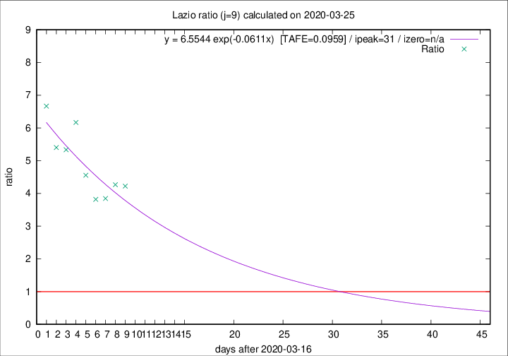

# Lazio

Data source: https://raw.githubusercontent.com/pcm-dpc/COVID-19/master/dati-json/dpc-covid19-ita-regioni.json

Delta days analysis (j): 9

Analyses for other values of j for 2020-03-25 are avalable [here](../2020-03-25/README.md)

Analyses for Lazio for previous dates are avalable [here](../README.md)

## Fitting 
|fit type|best fit equation|tafe|tfe|ipeak|izero|
|-------|-----|--------|------|---|---|
|exp|y = 6.5544 exp(-0.0611x)  [TAFE=0.0959]|0.0959|0.0059|31|n/a|

## Data
|Date|Daily deaths|Cumulated deaths|Deaths in the last 9 days|Deaths in the 9 days before|ratio|
|----|----------|-----------|-------|--------------------|-----|
|2020-03-25|15|95|76|18|4.2222|
|2020-03-24|17|80|64|15|4.2667|
|2020-03-23|10|63|50|13|3.8462|
|2020-03-22|3|53|42|11|3.8182|
|2020-03-21|7|50|41|9|4.5556|
|2020-03-20|5|43|37|6|6.1667|
|2020-03-19|6|38|32|6|5.3333|
|2020-03-18|9|32|27|5|5.4000|
|2020-03-17|4|23|20|3|6.6667|

[Download data as CSV](COVID-19_lazio_j9_2020-03-25.csv)

Generated April 12th, 2020 at 17:02:01 UTC+0200 with https://github.com/robianc/COVID-19
